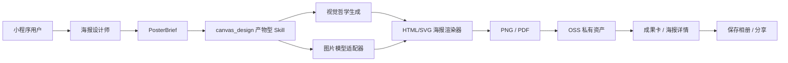

# Canvas Design 接入军师 App 方案

> 状态：评审后修订稿 v2（已对照代码逐项核实，开放问题已于 2026-07-29 全部拍板），尚未实施  
> 日期：2026-07-28 初稿 · 2026-07-29 按代码现状评审修订  
> 适用范围：`shared/`、`server/`、`app/`、`admin/`  
> 目标能力：个人宣传海报、品牌主视觉、活动海报等 PNG/PDF 静态视觉产出

## 1. 结论

Anthropic 的 `canvas-design` Skill 可以接入军师，并可在商业产品中修改使用。原项目对应文件采用 Apache License 2.0；引入时必须保留许可证与归属声明，修改过的文件需注明变更。

但它不能以“安装网页链接”的方式直接进入小程序。它本质上是：

- 一份 Agent Skill 指令；
- 一套“先形成视觉哲学，再在画布上表达”的工作流程；
- 一组字体资源；
- 依赖 Claude 文件系统、代码执行和文件输出能力的运行时约定。

军师的正式接入方式应是：**吸收 Canvas Design 的视觉工作流，改造成军师原生的产物型 Skill，并把实际生成任务纳入军师自己的任务、计费、存储、审核与分享体系。**

推荐最终链路：

```text
用户提出海报需求
  ↓
海报设计师整理商业目标与 PosterBrief
  ↓
canvas_design 形成视觉哲学与画面规格
  ↓
图片模型生成无文字主视觉（按需）
  ↓
军师确定性渲染器叠加中文、Logo、二维码与品牌元素
  ↓
生成 PNG / PDF，保存至 OSS
  ↓
对话成果卡 / 海报详情页预览、修改、保存、分享
```

## 2. 为什么值得接入

军师当前已经有：

- `poster` 海报设计师智能体（`server/src/data/agents.ts:368`，`billing='unlock'`、`price=8`、`deliverableKey='海报设计'`）；
- `BrandKit` 的 IP 人设、话术与视觉调性（persona/voice/theme + `version` + `approvedAt`，生态产品只读取已确认版本）；
- `SkillKind = 'tool' | 'output'` 的可插拔技能注册表（`server/src/llm/tools/registry.ts`）；
- 运营后台自定义 HTTP Skill（`httpTool.ts`，含 SSRF 防护与请求头加密）；
- OSS 私有/公开文件存储与短时签名 URL（`ossUpload.ts`，单 bucket 按对象 ACL）；
- 钻石预扣与失败退款（`credits.ts` 的 `reserveCredits`）、token 额度预留结算（`tokenQuota.ts` 的 `reserveQuota`，带 `done` 幂等标志，是幂等标杆）；
- Puppeteer HTML→PDF 生产级管线（`reportPdf.ts`：浏览器单例 + 单并发队列 + 超时 + 测试短路）；
- 小程序 Canvas 图片导出、保存相册与图片分享（`canvasCard.ts` / `reportShareCard.ts`）；
- 长任务退出重进恢复的成熟模式（`chatPending` TTL 桥接 + 服务端权威真值 + 分档轮询 + `liveGenCore` 收尾裁决）。

当前缺口不是“再加一段海报提示词”，而是：

1. 海报设计师目前只产出主视觉概念、文案和版式建议，没有成品文件；
2. 现有 `Tool` 只返回文本，现有 `OutputSkill` 只返回成果字段补丁（全库现存仅 `render_report` 一个）；
3. 没有任何图片生成模型接入（`server/src/llm/providers/` 只有 openai/claude 文本 provider；`meterUnit='image'` 目前只是计费口径，没有出图实现）；
4. 没有 PNG 截图渲染（Puppeteer 管线只做 PDF）；没有通用异步任务表与资产表（OSS key 目前散挂在各业务行字段上）；
5. 内容审核仅覆盖文本（`moderation.ts` 的 provider 抽象是 `(text) => verdict`），图片审核是全新能力；
6. 没有按“重新生成主视觉”和“只改文字重排”区分计费。

Canvas Design 适合作为这条管线的视觉方法底座。

## 3. 产品定位

### 3.1 首个场景

第一期只做“个人宣传海报”：

- 创始人个人介绍；
- 专家/顾问服务介绍；
- 朋友圈业务宣传；
- 线下活动嘉宾介绍；
- 直播、课程、咨询服务预告。

用户获得的不是一份“设计建议”，而是一张可以直接保存和发送的图片。

### 3.2 用户入口

主入口放在（对齐现有信息架构：执行 tab 现名「军令」，创作能力所在区块为「AI 创作发布」）：

```text
执行（军令）→ AI 创作发布 → 海报设计师
```

对话 tab 的海报设计师会话本身也是入口：成果卡上直接提供「生成成品图」。

次入口可以放在：

```text
我的品牌资产 → 生成宣传海报
```

对话中的海报成果卡提供：

- 生成成品图；
- 修改文案；
- 更换风格；
- 重新生成主视觉；
- 保存相册；
- 分享好友；
- 查看历史版本。

### 3.3 用户流程

用户只需补齐四类信息：

1. 宣传什么；
2. 给谁看；
3. 最希望对方记住什么；
4. 是否上传本人照片、Logo 或二维码。

如果已有已确认的品牌资产包，自动带入：

- IP 人设；
- 一句话定位；
- 语气风格；
- 品牌禁忌；
- 视觉关键词；
- 主色建议；
- 历史风格偏好。

没有品牌资产包时允许继续，不应把海报能力完全锁在品牌资产生成之后。

## 4. 核心设计原则

### 4.1 图片模型不负责写最终中文

图片模型只负责：

- 人物形象；
- 背景与场景；
- 光影；
- 构图；
- 材质；
- 留白区域。

以下内容必须由确定性渲染器完成：

- 中文主标题；
- 副标题和卖点；
- 姓名与身份；
- Logo；
- 二维码；
- 联系方式；
- 合规声明；
- 品牌落款；
- AI 生成内容标识。

原因：

- 图片模型仍可能生成错字、乱码或伪文字；
- 二维码必须真实可扫；
- Logo 不能发生变形；
- 用户修改一句文案时，不应重新调用图片模型；
- 固定排版才能稳定控制安全边距、字号和信息层级。

### 4.2 一张海报只讲一件事

Canvas Design 原始方法强调视觉优先和极少文字。军师接入后保留这一原则，但适配商业海报：

- 一个核心目标；
- 一个主标题；
- 一个行动号召；
- 最多三个证明点；
- 不把咨询报告直接压缩成海报；
- 信息过多时主动建议拆成多张，而不是缩小字号。

### 4.3 原创而非模仿

不得接受“完全照某位在世艺术家风格复制”等请求。可以表达：

- 几何秩序；
- 编辑设计；
- 东方留白；
- 纸张与墨迹质感；
- 纪实商业摄影；
- 高端杂志封面；
- 克制的品牌海报。

输出应描述视觉属性，不以复制具体艺术家作为生成条件。

## 5. 技术方案

### 5.1 总体架构



### 5.2 Skill 类型扩展

当前（`server/src/llm/tools/types.ts:11`）：

```ts
type SkillKind = 'tool' | 'output';
```

计划扩展为：

```ts
type SkillKind = 'tool' | 'output' | 'artifact';
```

语义：

- `tool`：模型在对话或成果生成中主动调用，返回文本；
- `output`：对结构化成果做确定性后处理，如生成网页版报告（执行点在 `POST /sessions/:id/messages/:mid/report`，不在模型循环内）；
- `artifact`：创建异步任务并生成 PNG、PDF 等二进制交付物。

第一期收敛（避免为单实例引入第三套执行语义）：

1. `artifact` 只作为 `SkillMeta.kind` 的新枚举值登记进技能库（后台统一展示、按 agent 勾选），改动量一行级别；同步改 admin 技能库的 kind 文案映射（`admin/src/views/studio.tsx` 的 `KIND_LABEL`）与 `normalizeSkills` 校验；
2. 不建通用 `ArtifactSkill` 多态注册表：第一期只有 `canvas_design` 一个 artifact 技能，`submit` 直接实现为 creative 服务模块的函数；等出现第二个 artifact 技能（封面/长图）再抽象注册表接口；
3. `artifact` 技能不进模型工具循环：模型不会调用它，触发点是成果卡按钮 / REST API（见 §9），执行是确定性的。

二期抽象时的目标契约（现在仅作参考，不落代码）：

```ts
interface ArtifactSkillContext {
  tenantId: string;
  userId: string;
  sessionId?: string;
  messageId?: string;
  agentKey: string;
  idempotencyKey: string;
}

interface ArtifactSkill {
  key: string;
  name: string;
  description: string;
  artifactTypes: Array<'png' | 'pdf'>;
  submit(
    input: Record<string, unknown>,
    ctx: ArtifactSkillContext,
  ): Promise<{ jobId: string }>;
}
```

`canvas_design` 注册为原生 `artifact` Skill，不作为普通 HTTP Tool 返回文本（key 命名符合技能库 `^[a-z][a-z0-9_]*$` 校验约束）。

### 5.3 PosterBrief 契约

任何接口和数据结构落地前，先更新 `shared/contracts.d.ts`。

建议结构：

```ts
export type PosterScene =
  | 'personal_brand'
  | 'event'
  | 'service'
  | 'product';

export type PosterRatio = '3:4' | '9:16' | '1:1';

export interface PosterBrief {
  scene: PosterScene;
  goal: string;
  audience: string;
  headline: string;
  subheadline?: string;
  proofPoints: string[];
  cta: string;
  visualDirection: string;
  negativePrompt?: string;
  templateKey?: string; // 缺省由服务端按 scene 选默认模板
  ratio: PosterRatio;
  portraitAssetId?: string;
  logoAssetId?: string;
  qrAssetId?: string;
  brandKitVersion?: number;
}
```

第一期服务端必须再次校验：

- 主标题长度；
- 卖点数量和长度；
- CTA 长度；
- 资产归属；
- MIME 类型；
- 画布比例；
- 模板是否启用。

补充约定：

- `brandKitVersion` 只允许引用已确认（`approvedAt` 非空）的品牌资产包版本，与 BrandKit 现有口径一致（生态产品只读取 approved 的资产包）；
- PosterBrief 不要求用户从零手填：服务端根据海报设计师成果消息 + BrandKit 预填草稿（见 §9.1 的 `brief-draft`），用户在确认页只做增删改；
- 模板推荐写进海报设计师提示词（2026-07-29 拍板）：设计师在成果中按用户意图给出 `templateKey` 推荐 + 一句「为什么这样设计」的推荐理由，`brief-draft` 预填采纳、确认页向用户展示理由制造惊喜感；**服务端只认模板白名单内的 key**，无效或缺失一律按 `scene` 回退默认模板，确认页允许用户手动更换——推荐是提示词的事，兜底是服务端的事，两者不混。

### 5.4 通用任务模型

建议使用通用 `CreativeJob`，而不是只为 Canvas Design 建一张专用表，方便后续扩展封面、长图、视频封面和分镜图。

```prisma
model CreativeJob {
  id               String   @id @default(cuid())
  tenantId         String
  userId           String
  sessionId        String?
  messageId        String?
  agentKey         String
  skillKey         String
  kind             String   // poster | cover | social_card
  status           String   // pending | running | succeeded | failed | cancelled
  progress         String?  // 用户可读阶段：philosophy | visual | render | upload
  parentJobId      String?  // revise/regenerate 版本链：新任务指向来源任务，成功任务的资产永不被覆盖
  engine           String   // native | anthropic_skill
  provider         String?
  providerTaskId   String?
  requestJson      Json
  resultJson       Json?
  promptSnapshot   String?  @db.Text
  idempotencyKey   String
  creditCost       Int      @default(0)
  chargedAt        DateTime?
  refundedAt       DateTime?
  errorCode        String?
  errorMessage     String?  @db.Text
  attempts         Int      @default(0)
  startedAt        DateTime?
  completedAt      DateTime?
  createdAt        DateTime @default(now())
  updatedAt        DateTime @updatedAt
  assets           CreativeAsset[]

  @@unique([userId, idempotencyKey]) // 幂等键按用户隔离：客户端生成的 key 不做全局唯一，避免跨用户撞键/探测
  @@index([userId, createdAt])
  @@index([status, createdAt])
  @@index([tenantId])
  @@map("creative_job")
}

model CreativeAsset {
  id          String   @id @default(cuid())
  jobId       String
  kind        String   // source | visual | poster_png | poster_pdf
  ossKey      String
  mimeType    String
  width       Int?
  height      Int?
  bytes       Int?
  metadataJson Json?
  createdAt   DateTime @default(now())

  job CreativeJob @relation(fields: [jobId], references: [id], onDelete: Cascade)

  @@index([jobId])
  @@map("creative_asset")
}
```

任务状态必须以数据库为真源，不能只存在于进程内存或页面 React 状态。这是从两处现状教训得来的硬要求：会话 `generating` 真值目前是进程内 Map（`sessionGeneration.ts`，重启即丢）；知识库 `processDocument` 曾用 fire-and-forget，进程重启会把条目永久卡在 `parsing` 且无人捞。CreativeJob 从第一天就要配 sweep 兜底（§10.3）。

命名对齐：`xxxJson` 字段后缀、`@@map` snake_case、cuid 主键、`tenantId` 必带，均沿用现有 schema 约定；仓库目前没有任何 Job/Asset 表，这两张是全新表。

### 5.5 成果资产契约

建议在 `Deliverable` 中新增：

```ts
export interface DeliverableAsset {
  id: string;
  kind: 'poster_png' | 'poster_pdf';
  mimeType: string;
  width?: number;
  height?: number;
  previewUrl?: string;
  downloadUrl?: string;
}

export interface Deliverable {
  // existing fields...
  assets?: DeliverableAsset[];
  creativeJobId?: string;
}
```

对话消息里只保存资产 ID 和必要元数据，不保存大体积 base64。

落点：任务成功后按现有「成果补丁」路径回写成果消息 `contentJson`（与 `render_report` 写回 `htmlUrl` 是同一模式），前端 ReportCard 沿用「有 messageId + 非降级才算已生成」的硬规则展示，保存/分享复用 `reportShareCard` 链路。

## 6. Canvas Design 的两种执行引擎

### 6.1 正式推荐：军师原生引擎

目录建议（对齐现有结构：任务与渲染属于服务层，不是 LLM 工具；注册胶水才进 `llm/tools/`）：

```text
server/src/creative/canvas-design/   # 方法资产：上游许可证、设计哲学、字体、模板
├── LICENSE.txt
├── NOTICE.md
├── design-philosophy.md
├── fonts/
└── templates/
server/src/services/creative/        # 运行时：契约校验、哲学生成、渲染、任务 worker
├── schema.ts
├── philosophy.ts
├── renderer.ts
├── jobs.ts
└── worker.ts
server/src/llm/tools/registry.ts     # 仅登记 SkillMeta(kind='artifact')
```

执行步骤：

1. 基于 PosterBrief、品牌资产和用户历史生成“视觉哲学”（走现有服务端 LLM 池，token 消耗计入任务成本，不额外扣用户 token 额度）；
2. 把视觉哲学约束为结构化 `CanvasSpec`；
3. 如需要人物或场景，调用独立图片模型生成无文字主视觉；
4. 使用 HTML/CSS/SVG 构建海报；
5. 复用 `reportPdf.ts` 的浏览器单例/队列/超时骨架，新增 `page.screenshot` 生成 PNG（现有管线只做 PDF，截图是新增的函数级能力，不是新依赖）；
6. 需要 PDF 时复用浏览器打印管线；
7. 校验尺寸、文字溢出和文件完整性；
8. 上传 OSS；
9. 更新任务、成果消息和资产列表。

优点：

- 不依赖单一模型供应商；
- 可复用军师现有 OSS、审核、计费和监控；
- 中文和品牌元素可控；
- 可离线测试模板；
- 可以逐步用不同图片模型做 A/B。

### 6.2 可选 POC：Claude Custom Skill API

原始 Skill 可以上传为 Claude Custom Skill，然后通过：

- Skills API；
- Messages API；
- code execution；
- Files API；
- container；

完成 PNG/PDF 生成。

此模式只作为：

- 质量对照；
- 内部设计探索；
- 非敏感海报 POC；
- 原生引擎模板参考。

不建议第一期直接作为唯一生产引擎，原因：

- 需要官方 Claude Skills/Files/Code Execution 能力，兼容网关不能替代；
- 代码执行和文件容器成本、耗时更高；
- 容器运行时无网络，字体和资源必须打包；
- 生成结果和军师自己的任务/计费/审计需要额外桥接；
- 官方文档目前明确提示 Agent Skills 不属于 Zero Data Retention 能力，个人肖像与企业敏感素材需要更严格评估。

预留配置：~~已废弃，2026-07-29 全部删除，一个都没有落地保留~~

```env
# ⚠️ 以下五个变量已于 2026-07-29 从代码、.env.example、.env.test 中**彻底删除**
#（`_ANTHROPIC_SKILL_ID` 一天都没实现过）。保留这段只为记录「当初为什么想要它们、
# 后来为什么一个都不留」，不要照着配。
CANVAS_DESIGN_ENABLED=false            # 删：与后台开关取合取 → 静默失败；作熔断又要 SSH+重启
CANVAS_DESIGN_ENGINE=native            # 删：全仓无 `engine ===` 分支，改它只改变库里那个标签
CANVAS_DESIGN_ANTHROPIC_SKILL_ID=      # 删：POC 引擎没做（§19 明确不做），配置位空挂
CANVAS_DESIGN_MAX_CONCURRENCY=2        # 删：连配置项本身一起删（见 §8.1 与 §21「渲染并发」行）
CANVAS_DESIGN_TIMEOUT_MS=180000        # 删：只作 payload 缺省，后台保存一次即永久失效（双真源）
```

本功能最终**一个环境变量都没有**：开关 / 单价 / 日限额 / 渲染超时 / 模板启停 / 图片供应商全在后台「创作任务」页，
单一真源 = `FeatureFlag` 行 `creative-poster` 的 `enabled + payload`。理由见 §14 与 `server/src/env.ts` 同名段落。

## 7. 图片生成与 Canvas Design 的边界

Canvas Design 主要解决：

- 视觉方向；
- 构图；
- 版式；
- 色彩；
- 字体；
- 纹理；
- 信息层级；
- 最终 PNG/PDF 交付。

它不能替代专门的图片生成/编辑模型完成：

- 保持本人相貌；
- 人像写真；
- 换服装或换场景；
- 产品图重绘；
- 复杂抠图；
- 写实摄影。

建议接口：

```ts
interface VisualProvider {
  submit(input: VisualRequest): Promise<{ taskId: string }>;
  query(taskId: string): Promise<VisualTaskResult>;
  cancel?(taskId: string): Promise<void>;
}
```

注意现状：仓库目前没有任何图片生成接入（providers 目录只有 openai/claude 文本 provider），`VisualProvider` 是从零新建的模块。

接入方式（2026-07-29 拍板）：**不硬编码供应商，做成后台可配的模型接入点**——第一期交付通用适配器（baseUrl / model / apiKey / 请求参数模板，密钥走 `secretBox` 加密存储，复用 aiConfig 的 provider 配置模式）+ 后台配置页 + 连通性试跑（dry-run），具体供应商由运营在后台配置并可随时切换。图片模型只返回主视觉素材，最终海报仍由 `canvas_design` 统一排版。

## 8. 渲染器设计

### 8.1 技术选择

第一期使用：

```text
HTML + CSS + SVG + Puppeteer screenshot
```

理由：

- 服务端已依赖 Puppeteer 且有生产级管线（浏览器单例、单并发队列、超时、测试短路、`onClose` 收尾）；
- 中文字体、自动换行和渐变比纯 Canvas 更容易控制；
- 模板容易预览、测试和运营验收；
- PNG 与 PDF 可以共用一套布局；
- 不需要新增难部署的原生图形依赖。

落地注意：

- 输出分辨率用 viewport + `deviceScaleFactor` 控制（如 3:4 主规格 1080×1440 = 540×720 @2x），不要渲染后再放大；
- 现有渲染队列是单并发，所以**根本不该有「并发」这个旋钮**——这条当初写成「`CANVAS_DESIGN_MAX_CONCURRENCY` 必须与队列对齐、第一期用 1」，实现时还是既加了 env 又加了后台配置项，标签写「worker 并发槽（1–8）」。2026-07-29 连配置项一起删掉：worker 一轮是串行 `await`，渲染又被 `reportPdf` 的单并发队列串起来，任何大于 1 的值都只是个不会兑现的承诺。现为内部常量 `TICK_BATCH_SIZE = 2`（含义是「一轮最多连处理几单」，不是并发）。真要并行得先给海报单独的浏览器实例池并压内存上限，那时再谈参数；
- 渲染超时（`timeoutMs`，后台可配）上限 480s 是个**不变式**：必须小于 worker 的 `STALE_RUNNING_MS`（10 分钟，sweep 判卡死重新入队的阈值），否则一次正常的长渲染会在还没结束时被抢回队列、同一单跑两遍产出两张资产。第一版把上限写成 900s，正好越过这条线；
- 部署镜像必须内置商用授权中文字体（`deploy/Dockerfile.server` 加字体层），海报渲染不得依赖宿主机系统字体。

### 8.2 画布规格

MVP 先支持：

- 3:4：个人宣传海报主规格；
- 9:16：朋友圈/故事型长屏；
- 1:1：社群与头像式方图。

前端可以只先开放 3:4，其余规格在服务端与模板层预留。

### 8.3 模板要求

第一期三套模板：

1. 人物主视觉：人物占主要画面，适合创始人/专家介绍；
2. 编辑杂志：大留白、强标题、适合观点和定位；
3. 商业发布：信息更明确，适合活动、课程、咨询服务。

所有模板必须满足：

- 标题两行以内；
- 不允许文字重叠；
- 不允许元素越界；
- 二维码留足静区；
- Logo 不拉伸；
- 中文字体用开源授权（2026-07-29 拍板：OFL 字体，如思源黑体 / 思源宋体 / 霞鹜文楷，允许商用与打包分发），随镜像内置；
- 1080px 级输出清晰；
- 最终图片不引用会过期的外链资源。

## 9. API 设计

### 9.1 创建海报任务

```http
GET  /creative/posters/brief-draft?sessionId=&messageId=   # 从成果消息 + BrandKit 预填 PosterBrief 草稿
POST /creative/uploads                                     # 人像/Logo/二维码源素材上传，落 CreativeAsset(kind='source')
POST /creative/posters
```

`POST /creative/posters` 门禁顺序：登录 → 功能开关 → 海报设计师已解锁（未解锁 403 `AGENT_LOCKED`，与 `assertAgentAccess` 同口径）→ 套餐有效（403 `PLAN_EXPIRED`）→ 钻石充足（402 `INSUFFICIENT_CREDITS`）→ Brief 校验 → 频控/日限额。

`/creative/uploads` 复用聊天图片上传的约束口径（MIME 白名单、单张 ≤10MB、私有 OSS）。

请求：

```json
{
  "brief": {},
  "sessionId": "optional",
  "messageId": "optional",
  "idempotencyKey": "client-generated"
}
```

响应：

```json
{
  "jobId": "xxx",
  "status": "pending",
  "creditCost": 10
}
```

### 9.2 查询任务

```http
GET /creative/jobs/:id
```

返回：

- 当前状态；
- 用户可读进度；
- 失败原因；
- 是否已退款；
- 输出资产；
- 可执行操作。

### 9.3 修改与重新生成

```http
POST /creative/jobs/:id/revise
POST /creative/jobs/:id/regenerate
POST /creative/jobs/:id/cancel
```

规则：

- 只改标题、卖点、CTA：复用主视觉，只重新排版；
- 更换人物、场景、风格：重新调用图片模型；
- 同一请求重复点击：通过幂等键返回原任务；
- 已成功任务不得被重试接口覆盖原资产，必须生成新版本。

### 9.4 文件访问

```http
GET /creative/assets/:id/file
```

默认要求登录并校验资产归属。服务端可以：

- 返回短时 OSS 签名 URL（`ossSignedUrl` 现成，默认 600 秒）；
- 或直接流式返回文件。

不要把用户人像与企业物料默认设为永久 public-read。

## 10. 异步任务与恢复

### 10.1 任务执行

第一期可以使用数据库任务表 + 单独 worker，不强依赖 Redis 队列（`ioredis` 本就是 optionalDependency，未配置时各服务均回退进程内实现）：

1. API 事务内创建任务并预扣（`chargeCredits` 支持传入事务句柄，同事务写 `chargedAt`）；
2. worker 用 `SELECT ... FOR UPDATE SKIP LOCKED` 抢占 `pending` 任务——天然多进程安全。现有 interval scheduler 注释明确「选主没做完，多进程只许一个实例开 `SCHEDULER_ENABLED`」，创作 worker 不要复刻这个单实例约束；
3. 写入 `running` 与 `startedAt`；
4. 调用视觉供应商；
5. 下载供应商临时结果；
6. 转存 OSS；
7. 渲染最终海报；
8. 写入资产并标记 `succeeded`；
9. 失败则记录错误并幂等退款。

后续并发量上升再切到 Redis/BullMQ 或云队列。

### 10.2 页面退出重进

小程序不得只依赖组件内 `busy`：

- 任务状态以 `CreativeJob.status` 为真源（DB 行，比会话 `generating` 的进程内 Map 更强：服务重启不丢）；
- 「点击生成 → 服务端落任务」的网络窗口用本地短标记桥接（同 `chatPending` 的 TTL 模式），任务落库后一切以任务行为准；
- 进入海报详情或会话成果卡时查询任务；
- `pending/running` 时按先快后慢轮询（复用聊天恢复的分档节奏：前 30 秒约 1.2s 一次，此后 3s，设总时长上限）；
- 完成后自动替换为成品预览；
- 会话列表可显示“海报制作中”；
- 用户离开页面不取消任务；
- 用户显式取消时才尝试取消供应商任务。

### 10.3 服务重启恢复

worker 启动 + 周期 sweep 处理（照抄支付对账 `sweepPendingOrders` 的「状态列 + 周期扫描自愈」模板；反例是知识库 fire-and-forget 把条目永久卡在 `parsing` 无人捞）：

- 长时间停留在 `running` 的任务；
- 已拿到 `providerTaskId` 的任务继续查询；
- 未提交供应商的任务重新提交；
- 超过最大尝试次数的任务失败并退款；
- 成功资产已存在但任务未收口时幂等补写。

## 11. 计费方案

当前 `poster` 海报设计师是一次性解锁智能体。建议保留：

- 解锁海报设计师：获得海报策划、主副文案、版式建议；
- 生成成品图：按实际图片生成任务单独扣钻石。

这样不会把一次性解锁价格误当作无限生成成本。

第一期计费规则：

- 任务创建事务内预扣（与 §10.1 一致：预扣即实扣，失败路径靠退款回补，形态与现有钻石轴一致）；
- 生成成功后完成消费；
- 供应商失败、审核失败、渲染失败：退款；
- 用户主动取消且供应商尚未产生计费：退款；
- 只修改文字并重新排版：不再扣图片生成费用；
- 重新生成人物、背景或风格：再次扣费；
- 退款必须通过 `CreativeJob.refundedAt` 条件更新（`updateMany where refundedAt: null` 抢占）保证只执行一次。**不要复用 `sessions.ts` 的 `CreditReservation` 内存闭包**：它跨不过 worker/服务重启的进程边界，且现有 `refund` 闭包本身没有幂等标志（`credits.ts:130-134`，与 `tokenQuota` 的 `done` 标志不对称，是已知坑）；
- 无限量套餐（余额 `-1`）现状是零流水（`appendCreditDelta` 对不限量直接 return，连 `CreditLedger` 都不写），因此任务成本与调用次数以 `creative_job.creditCost` 行记录为准，不指望流水表；
- 海报出图不走 `sessions.ts` 的 `meterUnit='image'` 路径（那是对话轮次内的计费口径），也不改 poster 的 `meterUnit`——保持 `text`：对话策划仍扣 token 额度，成品图在 creative API 单独扣钻石，两轴不混。

初始定价 **10 钻/张**（2026-07-29 拍板：先随定后校准）。价格写入后台可改配置，不硬编码在代码里；上线后按真实供应商成本与毛利目标校准。

## 12. OSS 与隐私

### 12.1 资产分级

- 用户上传照片、Logo、二维码：private；
- 图片模型中间主视觉：private；
- 最终海报：private；
- 用户主动创建公开分享页时，单独生成公开副本或走自有鉴权分享路由。

### 12.2 建议保留策略

建议默认：

- 未使用的上传源图：30 天自动清理；
- 失败任务中间产物：7 天自动清理；
- 用户确认的最终海报：保留至用户删除；
- 删除用户时同步删除关联 OSS 资产；
- OSS 删除失败进入补偿队列，不把数据库删除当作文件已删除。

最终保留周期需要在上线前由产品、隐私与法务确认。

### 12.3 肖像确认

上传人物照片前明确提示：

- 确认拥有本人或被授权人的肖像使用权；
- 不得冒用他人身份；
- 不得制作误导性代言；
- 未成年人素材需额外限制；
- 生成结果可能与本人存在差异。

## 13. 内容安全

至少覆盖：

- 输入文案审核；
- 上传图片审核；
- 图片模型 Prompt 审核；
- 供应商输出审核；
- 最终海报文案审核；
- 禁止伪造证书、官方背书、收益承诺；
- 禁止生成可误认的公众人物代言；
- 禁止侵权 Logo 与未经授权的品牌素材；
- 记录 provider request id、模型、Prompt 快照和审核结果；
- 清除不必要的 EXIF 和定位信息；
- 最终作品增加 AI 生成内容标识（显式水印 + 文件元数据隐式标识，见下方合规说明）。

现状与新增工作量：

- 文本侧可直接复用 `moderate()`（输出侧默认 fail-closed）；
- 图片审核是全新能力：现有 provider 抽象是 `(text) => verdict`，需要新增图片审核 provider（候选：阿里云内容安全，与现有 ali-oss / 阿里云短信同生态），覆盖用户上传源图与供应商输出图，列入阶段 B 工作项；
- AI 生成内容标识按《人工智能生成合成内容标识办法》（2025-09-01 施行）执行：显式标识默认开启、不提供整体关闭（可配置的只是样式与位置），并在文件元数据写入隐式标识。

审核失败时不向用户展示原始违规结果，并按实际供应商是否已计费决定退款策略；对用户侧统一返回可理解的失败原因。

## 14. 运营后台

第一期后台增加：

- `canvas_design` 启用/停用；
- 执行引擎选择；
- 图片供应商和模型；
- 单张钻石价格；
- 最大并发；
- 超时时间；
- 每用户日限额；
- 模板启用状态；
- 模板预览；
- 任务列表；
- 失败原因；
- 单任务重试；
- 单任务退款状态；
- 供应商成本与用户扣费统计。

任何密钥只保存在服务端加密字段或环境变量中，不下发前端。

工程约束：

- 新页面按后台规范登记 `admin/src/nav.ts`（归组 + hint + 命令面板别名），取数一律 `useResource` + `ViewState`，重试/退款等资金动作走 `ConfirmDialog`，样式只用 design token，提交前 `npm run lint:ui` 全绿；
- 技能库 kind 文案映射（`KIND_LABEL`）补 `artifact` 一项；
- 启停/价格等运行时开关走数据库配置（沿用 featureFlag / aiConfig 模式，后台可改、无需重启）。**开关只有这一层**（2026-07-29 定稿）：`FeatureFlag` 行 `creative-poster` 的 `enabled` 就是唯一真源，**行缺失视为关**（安全默认，先发代码天然不放量）。原计划的「env `CANVAS_DESIGN_ENABLED` 作部署级硬开关、两层任一关闭即关闭」已废弃——合取让「后台开了却不生效」成为静默失败，而它想承担的熔断职责比后台点一下慢一个数量级（SSH + 改 env + 重启）。「引擎」这个旋钮也一并删了（见 §6.2）。
- ⚠️ **后台写 payload 必须同时显式落 `enabled`**：`FeatureFlag.enabled` 在 prisma 里是 `@default(true)`，写 payload 走 upsert，而生产库本来没有这一行。运营第一次进后台「只改个单价」就会创建出 `enabled=true` 的行，把未验收的功能放量。`updateCreativeConfig` 因此在 patch 不带 `enabled` 时回落到当前值（行缺失 = false）。

## 15. 可观测性

建议指标：

```text
junshi_creative_jobs_total{skill,status,provider}
junshi_creative_job_duration_ms{skill,provider}
junshi_creative_provider_errors_total{provider,code}
junshi_creative_refunds_total{reason}
junshi_creative_assets_bytes_total{kind}
junshi_creative_queue_depth{status}
```

日志至少带：

- jobId；
- userId/tenantId 的脱敏标识；
- skillKey；
- provider/model；
- providerTaskId/requestId；
- 任务状态；
- attempt；
- creditCost；
- latency；
- errorCode。

不得在普通日志中打印：

- 原始人物照片；
- base64；
- 完整身份证明；
- API key；
- OSS 私有签名 URL；
- 未脱敏联系方式。

## 16. 降级与回滚

功能开关（最终形态：**后台一个开关，没有 env**）：

运营后台「创作任务」页 → 功能开关，即 `FeatureFlag` 行 `creative-poster` 的 `enabled`。关一下约 1 分钟内生效（60s 读缓存），不发版、不重启、不 SSH。原计划这里写的是 `CANVAS_DESIGN_ENABLED=false`，已删——熔断闸最重要的属性是「快且确定」，一个要登机器改文件重启进程的开关两条都不满足。

关闭后：

- 已成功海报仍可查看和下载；
- 进行中的任务完成或按运维策略取消；
- 新的成品图生成入口隐藏；
- 海报设计师仍可输出文字版主视觉建议；
- 不影响普通对话、方案生成和报告渲染。

供应商故障时：

- 不静默返回假海报；
- 提示“海报暂未制作完成，可稍后重试”；
- 失败任务退款；
- 保留 PosterBrief，用户无需重新填写；
- 可切换备用图片供应商后重新提交。

## 17. 分阶段实施

### 阶段 A：技术 POC

目标：证明 Canvas Design 方法能稳定产出军师风格 PNG。

工作项：

- 引入上游 Skill、字体和许可证；
- 做一套 3:4 HTML/SVG 模板；
- 输入固定 PosterBrief；
- 生成一张无人物的品牌海报；
- 输出 PNG 与视觉哲学 Markdown；
- 检查中文字体、边界和文件完整性；
- 在部署镜像同构环境（Docker + 内置字体）跑通渲染，不只在开发机验证；
- 与 Claude Custom Skill API 输出做一次质量对照。

不接 C 端，不扣费，不改生产数据库。

验收：

- 同一输入可重复生成无溢出的文件；
- 中文没有乱码；
- 视觉达到可用于内部评审的质量；
- 上游许可证完整保留。

### 阶段 B：后端 MVP

工作项：

- 先改 `shared/contracts.d.ts`；
- 新增 `artifact` Skill 契约；
- 新增 `CreativeJob/CreativeAsset`；
- 实现 `canvas_design` 注册与任务 worker；
- 接入 OSS；
- 接入一个图片供应商；
- 接入预扣、退款与幂等；
- 新增创建、查询、修改、取消、文件接口，以及 brief 预填与源素材上传端点；
- 海报设计师提示词升级：按用户意图推荐模板（`templateKey` + 推荐理由），供 brief 预填采纳，服务端白名单兜底；
- 图片供应商后台配置页（通用适配器 + 密钥加密 + dry-run 试跑），不硬编码供应商；
- 增加内容审核（文本复用 `moderate()`，图片接新供应商）和审计；
- 同步 `AGENTS.md` 与 `docs/CHANGELOG.md`（仓库活文档铁律）。

验收：

- 服务重启后任务可恢复；
- 重复请求不重复扣费；
- 失败最多退款一次；
- 成功文件可跨设备读取；
- 任务和资产严格按用户/租户隔离。

### 阶段 C：小程序 MVP

工作项：

- 海报设计师成果卡增加“生成成品图”；
- 新增海报需求确认页；
- 新增制作中状态；
- 新增成品预览与版本列表；
- 支持改文字、换风格、重新生成；
- 复用现有保存相册和分享能力；
- 处理 401、网络失败和分包跳转失败；
- 真机验证退出重进、后台完成与相册权限。

验收：

- 用户从需求到保存海报不超过一个主流程；
- 退出页面再进入能自动恢复；
- 微信真机可保存和分享；
- 无原生 tabbar、overlay、登录态回退问题。

### 阶段 D：运营与生产

工作项：

- 后台任务与成本看板；
- 模板管理；
- 限流与并发配置；
- 供应商切换；
- 隐私策略和用户协议；
- 生产灰度；
- 成本、失败率和质量复盘。

## 18. 测试基线

### 18.1 单元测试

- PosterBrief 长度与枚举校验；
- 模板选择；
- 文字换行；
- 超长标题降级；
- 二维码边距；
- Logo 等比缩放；
- 幂等键；
- 状态机合法转换；
- 预扣与退款；
- 资产归属；
- OSS key 不可猜；
- 敏感日志过滤。

### 18.2 集成测试

- 创建任务 → worker → 成功资产；
- 图片供应商失败 → 退款；
- 渲染器失败 → 退款；
- OSS 失败 → 退款；
- 回调/轮询重复 → 不重复完成；
- 并发重复提交 → 只创建一个任务；
- 服务重启 → running 恢复；
- 越权读取任务/资产 → 404；
- 未解锁海报设计师 → 403 AGENT_LOCKED；
- 套餐过期 → 403；
- 钻石不足 → 402；
- 401 → 小程序全局登录失效流程。

### 18.3 视觉回归

每个模板维护固定样例：

- 短标题；
- 两行标题；
- 中英文混排；
- 有/无人像；
- 有/无 Logo；
- 有/无二维码；
- 三个证明点；
- 极端长姓名和身份；
- 深色与浅色主视觉。

生成截图后做尺寸、边界和人工视觉验收。禁止只以“Puppeteer 没报错”作为视觉通过。

### 18.4 构建与真机

按仓库基线至少完成：

- `server` 类型检查与相关测试；
- `app` TypeScript 检查；
- `app` weapp 正式构建；
- `admin` 构建与 `lint:ui`；
- 微信开发者工具编译；
- 真机保存、分享、退出重进和登录失效回归。

## 19. MVP 明确不做

第一期不做：

- PDF 成品交付（打印管线现成、成本低，但小程序保存/分享场景只需要 PNG；接口与模板层预留，二期开放）；
- 人物 LoRA/专属模型训练；
- 无限画布和自由拖拽设计器；
- 复杂图层编辑；
- 一次批量生成四张以上；
- 视频海报；
- 自动投放；
- 任意字体在线下载；
- 用户自行上传执行脚本；
- 未审核的第三方 Skill 在线安装；
- 允许 Skill 直接访问数据库或本机任意文件；
- 把 Claude Custom Skill API 作为唯一生产引擎。

## 20. 上游来源与许可证

- Canvas Design Skill：
  `https://github.com/anthropics/skills/tree/main/skills/canvas-design`
- Skill 原文：
  `https://github.com/anthropics/skills/blob/main/skills/canvas-design/SKILL.md`
- License：
  `https://github.com/anthropics/skills/blob/main/skills/canvas-design/LICENSE.txt`
- Claude Agent Skills API：
  `https://platform.claude.com/docs/en/build-with-claude/skills-guide`

引入仓库时：

1. 固定上游 commit；
2. 保存未修改原文和许可证；
3. 在 `NOTICE.md` 写明来源、commit、引入日期；
4. 修改版单独存放并标注“Modified for Junshi Strategic Staff”；
5. 不使用 Anthropic 商标暗示官方合作或认证；
6. 上游升级必须重新检查许可证、Prompt 行为和运行权限。

## 21. 实施决策摘要

| 项目 | 决策 |
|---|---|
| 能否接入 | 可以 |
| 是否直接安装链接 | 不可以 |
| 许可证 | Apache 2.0，保留许可证与修改声明 |
| 正式运行方式 | 军师原生 `artifact` Skill |
| 原版 Claude Skill API | 仅 POC/质量对照；**没有实现，也不留配置位**（原计划的 `CANVAS_DESIGN_ENGINE` 已删，见 §6.2） |
| 产品入口 | 执行 → 海报设计师 |
| 中文/Logo/二维码 | 确定性渲染，不交给图片模型 |
| 人物写真 | 独立图片模型提供 |
| 文件存储 | OSS private，按权限下载 |
| 长任务 | 数据库任务 + worker，可退出重进 |
| 计费 | 成品图按任务预扣，失败幂等退款 |
| 任务扣款锚点 | `CreativeJob` 行 `chargedAt/refundedAt` 条件更新，不用内存闭包 |
| 图片审核 | 需新增图片审核供应商（现有 moderation 仅文本）；**MVP 未接 = 合规缺口**，接口留缝、`http` 半成品已删（§13、AGENTS.md §13） |
| 渲染并发 | 复用浏览器单例骨架；**不提供并发配置项**（队列本就单并发，旋钮是假承诺），内部常量 `TICK_BATCH_SIZE=2` |
| 功能开关 | **只有一层**：后台 `FeatureFlag` 行 `creative-poster` 的 `enabled`，行缺失视为关；本功能无任何环境变量 |
| 渲染超时 | 后台可配，上限 480s；**必须小于 sweep 的 `STALE_RUNNING_MS`（10min）**，否则长渲染被重新入队双执行 |
| MVP 交付物 | 仅 PNG（PDF 二期，打印管线已现成） |
| Skill 抽象 | `SkillKind` 加 `artifact` 枚举登记；通用 `ArtifactSkill` 注册表等第二个实例再抽象 |
| 初始定价 | 10 钻/张（后台可改，上线后按真实成本校准） |
| 图片供应商 | 后台可配的通用接入点（密钥加密 + dry-run），不硬编码供应商 |
| 字体 | 开源 OFL 字体（思源黑体/宋体、霞鹜文楷等），随镜像内置 |
| 模板选择 | 海报设计师提示词按意图推荐（带推荐理由）+ 服务端白名单兜底 + 确认页可换（启用中的清单由 `/creative/status` 下发）；**显式请求被停用的模板 → 422**，未指定才按 scene 回退 |
| 第一主场景 | 个人宣传海报 |
| MVP 主规格 | 3:4（`PosterRatio` 契约已**收窄为单值** `'3:4'`；9:16 / 1:1 二期放开时往联合类型里加，让编译器指出该改的地方） |
| 第一阶段 | 技术 POC，不接生产、不扣费 |

## 22. 决策记录（2026-07-29 拍板，原「开放问题」全部关闭）

1. **单张钻石定价 → 已定**：先定 10 钻/张（覆盖「哲学生成 + 出图 + 渲染」全任务），价格进后台配置，上线后按真实供应商成本校准。参考锚点：现有 `meterUnit='image'` 为 3 钻/次（ip 智能体，无出图实现），海报为多段成本任务，定高是合理起点。
2. **图片供应商 → 已定**：不做供应商选型前置，第一期交付后台可配的模型接入点（通用适配器 + `secretBox` 密钥加密 + dry-run），供应商由运营后续配置。
3. **字体 → 已定**：开源 OFL 字体（思源黑体 / 思源宋体 / 霞鹜文楷），允许商用与镜像打包，无采购前置。
4. **模板缺省策略 → 已定，上线后收紧过一次**：海报设计师提示词按用户意图推荐 `templateKey` 并附推荐理由（确认页展示，制造惊喜感）；服务端白名单校验，用户可手动更换。**「未指定」与「指定了被停用的」必须区别对待**（2026-07-29 修）：未指定按 `scene` 回退默认；**显式请求了被运营停用的模板返回 422**，不静默换一套版式还照常扣 10 钻——用户为自己挑的那套付了钱，而运营停用某套模板通常正是因为它出问题了。启用中的清单由 `GET /creative/status` 下发（前端不再存本地目录），全部停用 = 无法建单。
5. **钻石退款幂等修复 → 已在修**：拆为独立会话进行中（与本方案解耦，不阻塞任何阶段）。
6. **功能开关层数 → 已定为一层（2026-07-29，上线当天推翻原设计）**：唯一真源 = 后台「创作任务」页那个开关（`FeatureFlag` 行 `creative-poster` 的 `enabled`），**行缺失显式视为关**。原设计的 env `CANVAS_DESIGN_ENABLED` 与它取合取，实现后立刻暴露两个问题：① 运营在后台打开却不生效，且界面无法解释原因，这是静默失败；② 它想承担的「部署级熔断」职责需要 SSH + 改 env + 重启，比后台点一下慢一个数量级，真出事时没人会走这条路。判断依据：env 开关在本仓的正当用途是回答「外部依赖是否存在」（embedding / rerank / moderation / pgvector 那批），而 puppeteer 与 OSS 是既有功能的硬依赖、字体已确认在镜像里，海报不属于那一类；预发是独立库 `junshi_preprod`，DB 开关本就按环境隔离。同批删掉 `_ENGINE`（会撒谎的旋钮：全仓无分支）与 `_MAX_CONCURRENCY` / `_TIMEOUT_MS`（只作 payload 缺省，后台保存一次即永久失效的双真源）——**本功能现在一个环境变量都没有**。
7. **`dailyLimit=0` 的语义 → 已定为「不限量」**：不是「禁止创建」。0=不限是通行约定，而且紧急停量该用功能开关（一次操作、语义明确、有审计），不该靠把限额改成 0 等用户撞墙。后台文案与契约注释已对齐，并有测试把「0 不拦截」钉住。

