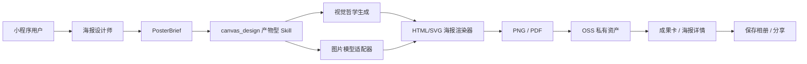

# Canvas Design 接入军师 App 方案

> 状态：方案评审稿，尚未实施  
> 日期：2026-07-28  
> 适用范围：`shared/`、`server/`、`app/`、`admin/`  
> 目标能力：个人宣传海报、品牌主视觉、活动海报等 PNG/PDF 静态视觉产出

## 1. 结论

Anthropic 的 `canvas-design` Skill 可以接入军师，并可在商业产品中修改使用。原项目对应文件采用 Apache License 2.0；引入时必须保留许可证与归属声明，修改过的文件需注明变更。

但它不能以“安装网页链接”的方式直接进入小程序。它本质上是：

- 一份 Agent Skill 指令；
- 一套“先形成视觉哲学，再在画布上表达”的工作流程；
- 一组字体资源；
- 依赖 Claude 文件系统、代码执行和文件输出能力的运行时约定。

军师的正式接入方式应是：**吸收 Canvas Design 的视觉工作流，改造成军师原生的产物型 Skill，并把实际生成任务纳入军师自己的任务、计费、存储、审核与分享体系。**

推荐最终链路：

```text
用户提出海报需求
  ↓
海报设计师整理商业目标与 PosterBrief
  ↓
canvas_design 形成视觉哲学与画面规格
  ↓
图片模型生成无文字主视觉（按需）
  ↓
军师确定性渲染器叠加中文、Logo、二维码与品牌元素
  ↓
生成 PNG / PDF，保存至 OSS
  ↓
对话成果卡 / 海报详情页预览、修改、保存、分享
```

## 2. 为什么值得接入

军师当前已经有：

- `poster` 海报设计师智能体；
- `BrandKit` 的 IP 人设、话术与视觉调性；
- `SkillKind = tool | output` 的可插拔技能注册表；
- 运营后台自定义 HTTP Skill；
- OSS 私有/公开文件存储；
- 钻石算力预扣与失败退款；
- 小程序 Canvas 图片导出、保存相册与图片分享；
- 长任务退出重进后的状态恢复经验。

当前缺口不是“再加一段海报提示词”，而是：

1. 海报设计师目前只产出主视觉概念、文案和版式建议，没有成品文件；
2. 现有 `Tool` 只返回文本，现有 `OutputSkill` 只返回成果字段补丁；
3. 没有 PNG/PDF 二进制产物的通用任务和资产模型；
4. 没有图片模型、排版渲染器与最终交付之间的标准管线；
5. 没有按“重新生成主视觉”和“只改文字重排”区分计费。

Canvas Design 适合作为这条管线的视觉方法底座。

## 3. 产品定位

### 3.1 首个场景

第一期只做“个人宣传海报”：

- 创始人个人介绍；
- 专家/顾问服务介绍；
- 朋友圈业务宣传；
- 线下活动嘉宾介绍；
- 直播、课程、咨询服务预告。

用户获得的不是一份“设计建议”，而是一张可以直接保存和发送的图片。

### 3.2 用户入口

主入口放在：

```text
执行 → 军师代笔 · 内容出品 → 海报设计师
```

次入口可以放在：

```text
我的品牌资产 → 生成宣传海报
```

对话中的海报成果卡提供：

- 生成成品图；
- 修改文案；
- 更换风格；
- 重新生成主视觉；
- 保存相册；
- 分享好友；
- 查看历史版本。

### 3.3 用户流程

用户只需补齐四类信息：

1. 宣传什么；
2. 给谁看；
3. 最希望对方记住什么；
4. 是否上传本人照片、Logo 或二维码。

如果已有已确认的品牌资产包，自动带入：

- IP 人设；
- 一句话定位；
- 语气风格；
- 品牌禁忌；
- 视觉关键词；
- 主色建议；
- 历史风格偏好。

没有品牌资产包时允许继续，不应把海报能力完全锁在品牌资产生成之后。

## 4. 核心设计原则

### 4.1 图片模型不负责写最终中文

图片模型只负责：

- 人物形象；
- 背景与场景；
- 光影；
- 构图；
- 材质；
- 留白区域。

以下内容必须由确定性渲染器完成：

- 中文主标题；
- 副标题和卖点；
- 姓名与身份；
- Logo；
- 二维码；
- 联系方式；
- 合规声明；
- 品牌落款；
- AI 生成内容标识。

原因：

- 图片模型仍可能生成错字、乱码或伪文字；
- 二维码必须真实可扫；
- Logo 不能发生变形；
- 用户修改一句文案时，不应重新调用图片模型；
- 固定排版才能稳定控制安全边距、字号和信息层级。

### 4.2 一张海报只讲一件事

Canvas Design 原始方法强调视觉优先和极少文字。军师接入后保留这一原则，但适配商业海报：

- 一个核心目标；
- 一个主标题；
- 一个行动号召；
- 最多三个证明点；
- 不把咨询报告直接压缩成海报；
- 信息过多时主动建议拆成多张，而不是缩小字号。

### 4.3 原创而非模仿

不得接受“完全照某位在世艺术家风格复制”等请求。可以表达：

- 几何秩序；
- 编辑设计；
- 东方留白；
- 纸张与墨迹质感；
- 纪实商业摄影；
- 高端杂志封面；
- 克制的品牌海报。

输出应描述视觉属性，不以复制具体艺术家作为生成条件。

## 5. 技术方案

### 5.1 总体架构



### 5.2 Skill 类型扩展

当前：

```ts
type SkillKind = 'tool' | 'output';
```

计划扩展为：

```ts
type SkillKind = 'tool' | 'output' | 'artifact';
```

语义：

- `tool`：模型在对话或成果生成中主动调用，返回文本；
- `output`：对结构化成果做确定性后处理，如生成网页版报告；
- `artifact`：创建异步任务并生成 PNG、PDF 等二进制交付物。

建议新增：

```ts
interface ArtifactSkillContext {
  tenantId: string;
  userId: string;
  sessionId?: string;
  messageId?: string;
  agentKey: string;
  idempotencyKey: string;
}

interface ArtifactSkill {
  key: string;
  name: string;
  description: string;
  artifactTypes: Array<'png' | 'pdf'>;
  submit(
    input: Record<string, unknown>,
    ctx: ArtifactSkillContext,
  ): Promise<{ jobId: string }>;
}
```

`canvas_design` 注册为原生 `artifact` Skill，不作为普通 HTTP Tool 返回文本。

### 5.3 PosterBrief 契约

任何接口和数据结构落地前，先更新 `shared/contracts.d.ts`。

建议结构：

```ts
export type PosterScene =
  | 'personal_brand'
  | 'event'
  | 'service'
  | 'product';

export type PosterRatio = '3:4' | '9:16' | '1:1';

export interface PosterBrief {
  scene: PosterScene;
  goal: string;
  audience: string;
  headline: string;
  subheadline?: string;
  proofPoints: string[];
  cta: string;
  visualDirection: string;
  negativePrompt?: string;
  templateKey: string;
  ratio: PosterRatio;
  portraitAssetId?: string;
  logoAssetId?: string;
  qrAssetId?: string;
  brandKitVersion?: number;
}
```

第一期服务端必须再次校验：

- 主标题长度；
- 卖点数量和长度；
- CTA 长度；
- 资产归属；
- MIME 类型；
- 画布比例；
- 模板是否启用。

### 5.4 通用任务模型

建议使用通用 `CreativeJob`，而不是只为 Canvas Design 建一张专用表，方便后续扩展封面、长图、视频封面和分镜图。

```prisma
model CreativeJob {
  id               String   @id @default(cuid())
  tenantId         String
  userId           String
  sessionId        String?
  messageId        String?
  agentKey         String
  skillKey         String
  kind             String   // poster | cover | social_card
  status           String   // pending | running | succeeded | failed | cancelled
  engine           String   // native | anthropic_skill
  provider         String?
  providerTaskId   String?
  requestJson      Json
  resultJson       Json?
  promptSnapshot   String?  @db.Text
  idempotencyKey   String   @unique
  creditCost       Int      @default(0)
  chargedAt        DateTime?
  refundedAt       DateTime?
  errorCode        String?
  errorMessage     String?  @db.Text
  attempts         Int      @default(0)
  startedAt        DateTime?
  completedAt      DateTime?
  createdAt        DateTime @default(now())
  updatedAt        DateTime @updatedAt
  assets           CreativeAsset[]

  @@index([userId, createdAt])
  @@index([status, createdAt])
  @@index([tenantId])
  @@map("creative_job")
}

model CreativeAsset {
  id          String   @id @default(cuid())
  jobId       String
  kind        String   // source | visual | poster_png | poster_pdf
  ossKey      String
  mimeType    String
  width       Int?
  height      Int?
  bytes       Int?
  metadataJson Json?
  createdAt   DateTime @default(now())

  job CreativeJob @relation(fields: [jobId], references: [id], onDelete: Cascade)

  @@index([jobId])
  @@map("creative_asset")
}
```

任务状态必须以数据库为真源，不能只存在于进程内存或页面 React 状态。

### 5.5 成果资产契约

建议在 `Deliverable` 中新增：

```ts
export interface DeliverableAsset {
  id: string;
  kind: 'poster_png' | 'poster_pdf';
  mimeType: string;
  width?: number;
  height?: number;
  previewUrl?: string;
  downloadUrl?: string;
}

export interface Deliverable {
  // existing fields...
  assets?: DeliverableAsset[];
  creativeJobId?: string;
}
```

对话消息里只保存资产 ID 和必要元数据，不保存大体积 base64。

## 6. Canvas Design 的两种执行引擎

### 6.1 正式推荐：军师原生引擎

目录建议：

```text
server/src/skills/canvas-design/
├── LICENSE.txt
├── NOTICE.md
├── design-philosophy.md
├── fonts/
├── templates/
├── schema.ts
├── philosophy.ts
├── renderer.ts
└── index.ts
```

执行步骤：

1. 基于 PosterBrief、品牌资产和用户历史生成“视觉哲学”；
2. 把视觉哲学约束为结构化 `CanvasSpec`；
3. 如需要人物或场景，调用独立图片模型生成无文字主视觉；
4. 使用 HTML/CSS/SVG 构建海报；
5. 通过现有 Puppeteer 截图生成 PNG；
6. 需要 PDF 时复用浏览器打印管线；
7. 校验尺寸、文字溢出和文件完整性；
8. 上传 OSS；
9. 更新任务、成果消息和资产列表。

优点：

- 不依赖单一模型供应商；
- 可复用军师现有 OSS、审核、计费和监控；
- 中文和品牌元素可控；
- 可离线测试模板；
- 可以逐步用不同图片模型做 A/B。

### 6.2 可选 POC：Claude Custom Skill API

原始 Skill 可以上传为 Claude Custom Skill，然后通过：

- Skills API；
- Messages API；
- code execution；
- Files API；
- container；

完成 PNG/PDF 生成。

此模式只作为：

- 质量对照；
- 内部设计探索；
- 非敏感海报 POC；
- 原生引擎模板参考。

不建议第一期直接作为唯一生产引擎，原因：

- 需要官方 Claude Skills/Files/Code Execution 能力，兼容网关不能替代；
- 代码执行和文件容器成本、耗时更高；
- 容器运行时无网络，字体和资源必须打包；
- 生成结果和军师自己的任务/计费/审计需要额外桥接；
- 官方文档目前明确提示 Agent Skills 不属于 Zero Data Retention 能力，个人肖像与企业敏感素材需要更严格评估。

预留配置：

```env
CANVAS_DESIGN_ENABLED=false
CANVAS_DESIGN_ENGINE=native
CANVAS_DESIGN_ANTHROPIC_SKILL_ID=
CANVAS_DESIGN_MAX_CONCURRENCY=2
CANVAS_DESIGN_TIMEOUT_MS=180000
```

## 7. 图片生成与 Canvas Design 的边界

Canvas Design 主要解决：

- 视觉方向；
- 构图；
- 版式；
- 色彩；
- 字体；
- 纹理；
- 信息层级；
- 最终 PNG/PDF 交付。

它不能替代专门的图片生成/编辑模型完成：

- 保持本人相貌；
- 人像写真；
- 换服装或换场景；
- 产品图重绘；
- 复杂抠图；
- 写实摄影。

建议接口：

```ts
interface VisualProvider {
  submit(input: VisualRequest): Promise<{ taskId: string }>;
  query(taskId: string): Promise<VisualTaskResult>;
  cancel?(taskId: string): Promise<void>;
}
```

第一期至少实现一个生产供应商，并保持供应商可切换。图片模型只返回主视觉素材，最终海报仍由 `canvas_design` 统一排版。

## 8. 渲染器设计

### 8.1 技术选择

第一期使用：

```text
HTML + CSS + SVG + Puppeteer screenshot
```

理由：

- 服务端已经依赖 Puppeteer；
- 中文字体、自动换行和渐变比纯 Canvas 更容易控制；
- 模板容易预览、测试和运营验收；
- PNG 与 PDF 可以共用一套布局；
- 不需要新增难部署的原生图形依赖。

### 8.2 画布规格

MVP 先支持：

- 3:4：个人宣传海报主规格；
- 9:16：朋友圈/故事型长屏；
- 1:1：社群与头像式方图。

前端可以只先开放 3:4，其余规格在服务端与模板层预留。

### 8.3 模板要求

第一期三套模板：

1. 人物主视觉：人物占主要画面，适合创始人/专家介绍；
2. 编辑杂志：大留白、强标题、适合观点和定位；
3. 商业发布：信息更明确，适合活动、课程、咨询服务。

所有模板必须满足：

- 标题两行以内；
- 不允许文字重叠；
- 不允许元素越界；
- 二维码留足静区；
- Logo 不拉伸；
- 中文字体有合法授权；
- 1080px 级输出清晰；
- 最终图片不引用会过期的外链资源。

## 9. API 设计

### 9.1 创建海报任务

```http
POST /creative/posters
```

请求：

```json
{
  "brief": {},
  "sessionId": "optional",
  "messageId": "optional",
  "idempotencyKey": "client-generated"
}
```

响应：

```json
{
  "jobId": "xxx",
  "status": "pending",
  "creditCost": 3
}
```

### 9.2 查询任务

```http
GET /creative/jobs/:id
```

返回：

- 当前状态；
- 用户可读进度；
- 失败原因；
- 是否已退款；
- 输出资产；
- 可执行操作。

### 9.3 修改与重新生成

```http
POST /creative/jobs/:id/revise
POST /creative/jobs/:id/regenerate
POST /creative/jobs/:id/cancel
```

规则：

- 只改标题、卖点、CTA：复用主视觉，只重新排版；
- 更换人物、场景、风格：重新调用图片模型；
- 同一请求重复点击：通过幂等键返回原任务；
- 已成功任务不得被重试接口覆盖原资产，必须生成新版本。

### 9.4 文件访问

```http
GET /creative/assets/:id/file
```

默认要求登录并校验资产归属。服务端可以：

- 返回短时 OSS 签名 URL；
- 或直接流式返回文件。

不要把用户人像与企业物料默认设为永久 public-read。

## 10. 异步任务与恢复

### 10.1 任务执行

第一期可以使用数据库任务表 + 单独 worker，不强依赖 Redis 队列：

1. API 事务内创建任务并预扣；
2. worker 抢占 `pending` 任务；
3. 写入 `running` 与 `startedAt`；
4. 调用视觉供应商；
5. 下载供应商临时结果；
6. 转存 OSS；
7. 渲染最终海报；
8. 写入资产并标记 `succeeded`；
9. 失败则记录错误并幂等退款。

后续并发量上升再切到 Redis/BullMQ 或云队列。

### 10.2 页面退出重进

小程序不得只依赖组件内 `busy`：

- 任务状态以 `CreativeJob.status` 为真源；
- 进入海报详情或会话成果卡时查询任务；
- `pending/running` 时按先快后慢轮询；
- 完成后自动替换为成品预览；
- 会话列表可显示“海报制作中”；
- 用户离开页面不取消任务；
- 用户显式取消时才尝试取消供应商任务。

### 10.3 服务重启恢复

worker 启动时处理：

- 长时间停留在 `running` 的任务；
- 已拿到 `providerTaskId` 的任务继续查询；
- 未提交供应商的任务重新提交；
- 超过最大尝试次数的任务失败并退款；
- 成功资产已存在但任务未收口时幂等补写。

## 11. 计费方案

当前 `poster` 海报设计师是一次性解锁智能体。建议保留：

- 解锁海报设计师：获得海报策划、主副文案、版式建议；
- 生成成品图：按实际图片生成任务单独扣钻石。

这样不会把一次性解锁价格误当作无限生成成本。

第一期计费规则：

- 进入图片模型前预扣；
- 生成成功后完成消费；
- 供应商失败、审核失败、渲染失败：退款；
- 用户主动取消且供应商尚未产生计费：退款；
- 只修改文字并重新排版：不再扣图片生成费用；
- 重新生成人物、背景或风格：再次扣费；
- 退款必须通过 `refundedAt` 和条件更新保证只执行一次；
- 无限量套餐仍需记录任务成本与调用次数，但不扣余额。

具体点数由真实供应商成本测试后决定，不在本方案中硬编码。

## 12. OSS 与隐私

### 12.1 资产分级

- 用户上传照片、Logo、二维码：private；
- 图片模型中间主视觉：private；
- 最终海报：private；
- 用户主动创建公开分享页时，单独生成公开副本或走自有鉴权分享路由。

### 12.2 建议保留策略

建议默认：

- 未使用的上传源图：30 天自动清理；
- 失败任务中间产物：7 天自动清理；
- 用户确认的最终海报：保留至用户删除；
- 删除用户时同步删除关联 OSS 资产；
- OSS 删除失败进入补偿队列，不把数据库删除当作文件已删除。

最终保留周期需要在上线前由产品、隐私与法务确认。

### 12.3 肖像确认

上传人物照片前明确提示：

- 确认拥有本人或被授权人的肖像使用权；
- 不得冒用他人身份；
- 不得制作误导性代言；
- 未成年人素材需额外限制；
- 生成结果可能与本人存在差异。

## 13. 内容安全

至少覆盖：

- 输入文案审核；
- 上传图片审核；
- 图片模型 Prompt 审核；
- 供应商输出审核；
- 最终海报文案审核；
- 禁止伪造证书、官方背书、收益承诺；
- 禁止生成可误认的公众人物代言；
- 禁止侵权 Logo 与未经授权的品牌素材；
- 记录 provider request id、模型、Prompt 快照和审核结果；
- 清除不必要的 EXIF 和定位信息；
- 最终作品增加可配置的 AI 生成内容标识。

审核失败时不向用户展示原始违规结果，并按实际供应商是否已计费决定退款策略；对用户侧统一返回可理解的失败原因。

## 14. 运营后台

第一期后台增加：

- `canvas_design` 启用/停用；
- 执行引擎选择；
- 图片供应商和模型；
- 单张钻石价格；
- 最大并发；
- 超时时间；
- 每用户日限额；
- 模板启用状态；
- 模板预览；
- 任务列表；
- 失败原因；
- 单任务重试；
- 单任务退款状态；
- 供应商成本与用户扣费统计。

任何密钥只保存在服务端加密字段或环境变量中，不下发前端。

## 15. 可观测性

建议指标：

```text
junshi_creative_jobs_total{skill,status,provider}
junshi_creative_job_duration_ms{skill,provider}
junshi_creative_provider_errors_total{provider,code}
junshi_creative_refunds_total{reason}
junshi_creative_assets_bytes_total{kind}
junshi_creative_queue_depth{status}
```

日志至少带：

- jobId；
- userId/tenantId 的脱敏标识；
- skillKey；
- provider/model；
- providerTaskId/requestId；
- 任务状态；
- attempt；
- creditCost；
- latency；
- errorCode。

不得在普通日志中打印：

- 原始人物照片；
- base64；
- 完整身份证明；
- API key；
- OSS 私有签名 URL；
- 未脱敏联系方式。

## 16. 降级与回滚

功能开关：

```env
CANVAS_DESIGN_ENABLED=false
```

关闭后：

- 已成功海报仍可查看和下载；
- 进行中的任务完成或按运维策略取消；
- 新的成品图生成入口隐藏；
- 海报设计师仍可输出文字版主视觉建议；
- 不影响普通对话、方案生成和报告渲染。

供应商故障时：

- 不静默返回假海报；
- 提示“海报暂未制作完成，可稍后重试”；
- 失败任务退款；
- 保留 PosterBrief，用户无需重新填写；
- 可切换备用图片供应商后重新提交。

## 17. 分阶段实施

### 阶段 A：技术 POC

目标：证明 Canvas Design 方法能稳定产出军师风格 PNG。

工作项：

- 引入上游 Skill、字体和许可证；
- 做一套 3:4 HTML/SVG 模板；
- 输入固定 PosterBrief；
- 生成一张无人物的品牌海报；
- 输出 PNG 与视觉哲学 Markdown；
- 检查中文字体、边界和文件完整性；
- 与 Claude Custom Skill API 输出做一次质量对照。

不接 C 端，不扣费，不改生产数据库。

验收：

- 同一输入可重复生成无溢出的文件；
- 中文没有乱码；
- 视觉达到可用于内部评审的质量；
- 上游许可证完整保留。

### 阶段 B：后端 MVP

工作项：

- 先改 `shared/contracts.d.ts`；
- 新增 `artifact` Skill 契约；
- 新增 `CreativeJob/CreativeAsset`；
- 实现 `canvas_design` 注册与任务 worker；
- 接入 OSS；
- 接入一个图片供应商；
- 接入预扣、退款与幂等；
- 新增创建、查询、修改、取消、文件接口；
- 增加内容审核和审计。

验收：

- 服务重启后任务可恢复；
- 重复请求不重复扣费；
- 失败最多退款一次；
- 成功文件可跨设备读取；
- 任务和资产严格按用户/租户隔离。

### 阶段 C：小程序 MVP

工作项：

- 海报设计师成果卡增加“生成成品图”；
- 新增海报需求确认页；
- 新增制作中状态；
- 新增成品预览与版本列表；
- 支持改文字、换风格、重新生成；
- 复用现有保存相册和分享能力；
- 处理 401、网络失败和分包跳转失败；
- 真机验证退出重进、后台完成与相册权限。

验收：

- 用户从需求到保存海报不超过一个主流程；
- 退出页面再进入能自动恢复；
- 微信真机可保存和分享；
- 无原生 tabbar、overlay、登录态回退问题。

### 阶段 D：运营与生产

工作项：

- 后台任务与成本看板；
- 模板管理；
- 限流与并发配置；
- 供应商切换；
- 隐私策略和用户协议；
- 生产灰度；
- 成本、失败率和质量复盘。

## 18. 测试基线

### 18.1 单元测试

- PosterBrief 长度与枚举校验；
- 模板选择；
- 文字换行；
- 超长标题降级；
- 二维码边距；
- Logo 等比缩放；
- 幂等键；
- 状态机合法转换；
- 预扣与退款；
- 资产归属；
- OSS key 不可猜；
- 敏感日志过滤。

### 18.2 集成测试

- 创建任务 → worker → 成功资产；
- 图片供应商失败 → 退款；
- 渲染器失败 → 退款；
- OSS 失败 → 退款；
- 回调/轮询重复 → 不重复完成；
- 并发重复提交 → 只创建一个任务；
- 服务重启 → running 恢复；
- 越权读取任务/资产 → 404；
- 套餐过期 → 403；
- 钻石不足 → 402；
- 401 → 小程序全局登录失效流程。

### 18.3 视觉回归

每个模板维护固定样例：

- 短标题；
- 两行标题；
- 中英文混排；
- 有/无人像；
- 有/无 Logo；
- 有/无二维码；
- 三个证明点；
- 极端长姓名和身份；
- 深色与浅色主视觉。

生成截图后做尺寸、边界和人工视觉验收。禁止只以“Puppeteer 没报错”作为视觉通过。

### 18.4 构建与真机

按仓库基线至少完成：

- `server` 类型检查与相关测试；
- `app` TypeScript 检查；
- `app` weapp 正式构建；
- `admin` 构建与 `lint:ui`；
- 微信开发者工具编译；
- 真机保存、分享、退出重进和登录失效回归。

## 19. MVP 明确不做

第一期不做：

- 人物 LoRA/专属模型训练；
- 无限画布和自由拖拽设计器；
- 复杂图层编辑；
- 一次批量生成四张以上；
- 视频海报；
- 自动投放；
- 任意字体在线下载；
- 用户自行上传执行脚本；
- 未审核的第三方 Skill 在线安装；
- 允许 Skill 直接访问数据库或本机任意文件；
- 把 Claude Custom Skill API 作为唯一生产引擎。

## 20. 上游来源与许可证

- Canvas Design Skill：
  `https://github.com/anthropics/skills/tree/main/skills/canvas-design`
- Skill 原文：
  `https://github.com/anthropics/skills/blob/main/skills/canvas-design/SKILL.md`
- License：
  `https://github.com/anthropics/skills/blob/main/skills/canvas-design/LICENSE.txt`
- Claude Agent Skills API：
  `https://platform.claude.com/docs/en/build-with-claude/skills-guide`

引入仓库时：

1. 固定上游 commit；
2. 保存未修改原文和许可证；
3. 在 `NOTICE.md` 写明来源、commit、引入日期；
4. 修改版单独存放并标注“Modified for Junshi Strategic Staff”；
5. 不使用 Anthropic 商标暗示官方合作或认证；
6. 上游升级必须重新检查许可证、Prompt 行为和运行权限。

## 21. 实施决策摘要

| 项目 | 决策 |
|---|---|
| 能否接入 | 可以 |
| 是否直接安装链接 | 不可以 |
| 许可证 | Apache 2.0，保留许可证与修改声明 |
| 正式运行方式 | 军师原生 `artifact` Skill |
| 原版 Claude Skill API | 仅 POC/质量对照，可配置备用 |
| 产品入口 | 执行 → 海报设计师 |
| 中文/Logo/二维码 | 确定性渲染，不交给图片模型 |
| 人物写真 | 独立图片模型提供 |
| 文件存储 | OSS private，按权限下载 |
| 长任务 | 数据库任务 + worker，可退出重进 |
| 计费 | 成品图按任务预扣，失败幂等退款 |
| 第一主场景 | 个人宣传海报 |
| MVP 主规格 | 3:4 |
| 第一阶段 | 技术 POC，不接生产、不扣费 |

