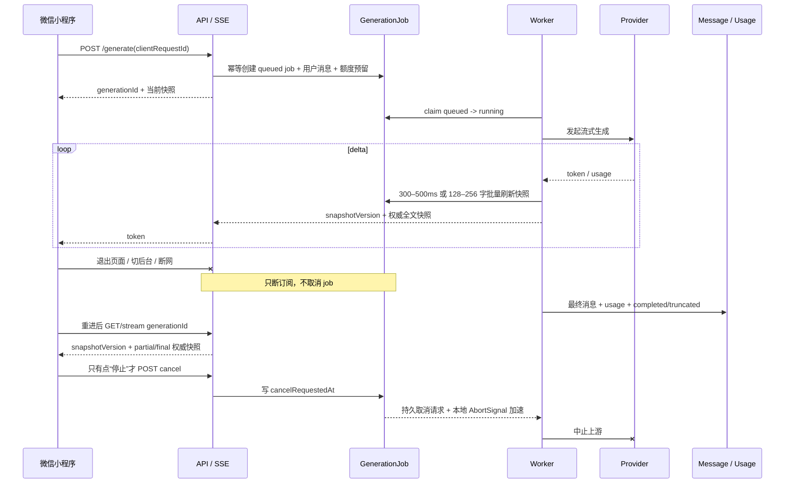

# 军师 · 对话生成可靠性修复方案

> 状态：**已按拍板口径实现，本地回归通过，待生产发布与 24h 线上验收**（2026-08-05）。本文件同时保留事故证据、设计不变式、实现映射和上线门槛；不得因“代码已完成”跳过数据备份、部署检查或真实账号验收。
>
> **2026-08-05 追加**：对已上线区间 `3ae9e2b..a57c4f5`（9 个提交）做了一轮七视角独立评审 + 逐条对抗性证伪，
> 证伪后成立、语义去重后共 **35 条**。它们已按语义并入下列各章（§2 结论表、§6 时间语义、§7 残文与 usage、
> §8 推荐选项、§10 P2、§11 观测、§12 测试），完整清单见 **§17 附录**；与本方案无关的邻域发现另见 **§18**。
> 结论未变：本方案方向成立，已上线的那批属 §13 末尾所述「临时止损」，且止损效力此前被高估。
>
> 产品决策：回复后的推荐选项继续保留；正常持续输出 token 时，不以“已输出 60 秒”为由粗暴截断；用户退出页面、小程序切后台或网络断开，只代表观看连接消失，**不代表用户取消生成**。

## 实现落点（2026-08-05）

| 已拍板事项 | 当前实现 |
|---|---|
| 生成消耗统一结算 | `GenerationJob/Attempt` 累加所有已发起真实 provider 的 usage；无 usage、失败、取消或租约恢复按保守估算；纯 mock、缓存命中、输入审核前拦截为 0。输出审核发生在上游调用之后，仍先落 TokenUsage 并结算。固定钻石/成果费仍按是否交付另算。 |
| 生成中不允许再问 | app 输入区在 busy 时禁用并只显示停止键；服务端用 `Session.activeGenerationId` CAS 拦旧客户端/并发绕过，返回 409 `GENERATION_IN_PROGRESS`，不隐式排队。 |
| 推荐选项补生成 | 主正文先落库；缺失选项以 `ask_recovery` attempt 在 3s 独立预算内补齐，失败只少选项、不回滚正文，真实调用纳入同一 job 结算。 |
| 退出/重进 | SSE/HTTP 只是订阅；断连不 Abort worker。会话列表显示 queue/context/provider/finalize，进入原会话按 `generationId + snapshotVersion` 权威全文快照恢复，不强跳；只有显式停止调 cancel。生产上不带 `clientRequestId` 的旧客户端请求也由服务端补一次性 key 后进入持久链路，不再回落到断连即取消的内联实现。 |
| 每日战报 | 新增 `GET /cards/daily` + `packages/work/daily`鉴权内嵌页；旧发布入口 410，历史 daily `/api/r/:id(.pdf)` 404，不再生成/复制公开链接。 |
| 排盘引擎 v3 | 新排/主动重排写 `paipan-v3`；存量 v1/v2 照旧读取。城市匹配改为文本首出现且排除路名，完整行政后缀先清理，真太阳时跨 UTC 日进位与 `trueSolarApplied` 判据纳入版本回归。 |
| 监控/部署 | 新增 job 结果/分段时长/恢复/估算结算指标，封闭标签集从 0 暴露；429 率需 10m 至少 20 样本。监控配置哈希变化强制重建单文件挂载容器，reload/readiness/SHA/实际规则数任一不对即部署失败。 |

当前还差的不是产品拍板或本地实现，而是生产发布权限下的上线动作与 §12.4 的 24h 真实流量验收；本次未部署，不把本地绿灯写成“线上已修复”。

## 0. 已冻结的产品口径

以下口径于 2026-08-05 拍板，实施中不得自行改义：

1. **生成用量统一结算。** 只要真实 provider 调用已经发起，无论最终是完成、截断、用户主动停止、provider/系统失败还是恢复重试，都按 provider 已知 usage 或本地估算 usage 计入本次消耗；不再按终止原因做用户额度免单。未发起 provider 的校验失败/排队取消按 0 结算。所有路径仍须释放“预留额 − 实际消耗”的差额，且同一 job 只结算一次。固定钻石/成果费沿用既有交付规则，不与 Token 用量混成一套账。
2. **生成中不允许再次发送。** 保持当前交互：输入框真正锁定并置灰，不接收草稿更新、不发送；服务端仍以“同一 session 仅一个 active job”做最终防线，禁止隐式排队、静默取消上一轮或并发乱序。
3. **推荐选项及缺失选项补生成继续保留。** 补生成同样属于真实模型消耗，必须归属到 tenant/user/session/job 并纳入统一用量结算；但它不得阻塞主正文落库或导致正文失败。
4. **重进不强制跳页。** 会话列表展示“生成中/已完成”；用户进入原会话后自动读取最新快照并续接。小程序启动或回到前台时不强制劫持到该会话。
5. **每日战报改成小程序内嵌鉴权页面。** 不再生成、复制或依赖可永久公开访问的战报链接；历史 daily 公开页须回收。本次已实现，发布后按当前登录账号做隔离验收。
6. **排盘引擎升 `paipan-v3`。** 新排盘和用户主动重排使用 v3；存量 v2 不静默批量改写，保留原 `engineVersion` 供追溯。

## 1. 复核结论

结合 2026-08-04 至 2026-08-05 的线上日志、`llm_trace`、消息表、用量表、Nginx access log 和 Prometheus 后，原方案需要作三处关键调整：

1. **`GenerationJob` 从 P2 提升到 P0。** 当前生成事实仍绑在一条 HTTP 连接上，无法正确实现“退出后继续生成、重进续看”；单纯把 60 秒调成 150 秒或在 165 秒强制收尾，只能止损，不能满足产品语义。
2. **断连与取消必须彻底拆开。** 页面退出、切后台、弱网和 180 秒传输超时只关闭订阅；只有用户明确点“停止生成”才中止 provider。任务在服务端继续运行并定期保存快照。
3. **禁止昂贵流式调用失败后无条件整轮重生。** 线上出现“原生流跑到 8,000 output token → 再走同步兜底 → 又卡满 60 秒”的链路，既延迟失败，又放大成本；重试、故障转移和幂等必须归到同一个 job 内。

4. **端上超时必须与服务端同批处理，否则服务端抬预算等于空转。** 已证实：非流式路径
   `app/src/services/api.ts` 的 `Taro.request` 未设 `timeout`，`app/src/app.config.ts` 也没有
   `networkTimeout` → 微信默认约 60 秒先掐断。把服务端非流式预算从 60s 抬到 150s（`a57c4f5` 已上线）
   在真机上**没有任何可观察效果**，用户仍在精确的 60.0 秒拿到「军师响应超时了」，与修复前不可区分。
   同一坑在流式路径早已规避（`streaming.ts` 显式 `timeout: 180000`，AGENTS.md 亦有明文），非流式漏了。
   **推论：§3.1 那 6 条「精确 60.0 秒」的症状并未被消除。**

目标架构是：**HTTP/SSE 是观看通道，PostgreSQL 中的 GenerationJob 才是生成事实源。**

## 2. 哪些是已证实问题，哪些只是条件性风险

本节保留的是 2026-08-05 实施前的证据与处置判断；“当前代码”均指当时线上基线。实际完成状态以文首“实现落点”和 §13 为准，避免把事故复盘改写成事后叙事。

| 项目 | 线上/代码结论 | 处理 |
|---|---|---|
| Claude 文字 delta 被跳过 | 已证实是旧版本确定性 bug；当时 Nginx 多次只返回 57 字节的 `meta`，provider 却继续生成到上限 | 已由 `39259e3` 修复并随 `a57c4f5` 于 2026-08-05 10:28 CST 部署。**已回归验证**：生产直驱 provider 实测 75 段 delta，且「流出字符数 == 最终正文字数」（不等即说明走了 `finalMessage` 兜底）；回归用例 `server/test/claudeStream.test.ts` |
| 8,000 token 后转同步兜底 | 近 48 小时明确出现 4 次上限错误，随后同链路出现 60 秒同步超时 | P0：按终止原因决定是否重试；已有上游消耗或残文时不得整轮重生 |
| 断连被当取消、残文不落库 | 当前 `/generate` 代码明确在 `clientGone` 后退款并直接返回；连接断开时无法恢复 | P0：持久任务、快照、重连；断连不取消 |
| 客户端断开后 provider 仍继续跑 | 线上明确出现；当前 `clientGone` 只能在下一次 generator yield 后被检查，无法立刻改变正在等待的调用 | P0：任务独立后不再把断连当取消；显式取消必须用 AbortSignal 立即透传 |
| 重试/补发形成同会话并发 | 样本会话在前一轮仍生成时继续落入新用户消息；服务端没有持久 idempotency key | P0：`clientRequestId` 幂等 + 每会话串行化 |
| 错误调用 usage 记 0 | 4 次已生成到 8,000 token 的错误 trace 仍是 input/output=0，且没有对应 TokenUsage | P0：provider 已知值优先，缺失时按上下文与残文估算，禁止整轮当零成本 |
| 推荐选项兜底拖尾 | 功能本身正确；线上没有证据证明它造成这批失败，但当前辅助调用没有独立尾部预算 | P1：主消息先持久化；兜底限时、失败不影响正文完成 |
| 长文归卷与发送竞态 | 当前代码仍允许归卷 pending 时发送，且失败回填可覆盖发送后的新输入 | P1：composer 状态机与本轮快照 |
| OpenAI 池端点 Thinking 配置 | 仅当实际命中端点与基础配置不同才触发，当前生产主链是 Claude | P2：仍修，但不冒充本次线上主因 |
| 单文件 bind mount | inode 被替换时确定存在；与本次对话错误无直接因果 | P2：独立部署修复 |
| **端上非流式 60s 上限** | **已证实**：`api.ts` 的 `Taro.request` 未设 `timeout`、`app.config.ts` 无 `networkTimeout` → 微信默认约 60s。服务端 150s 抬升真机零效果 | **P0**：与服务端预算同批改（见 §6.1） |
| **首轮与续写轮都没有轮内墙钟** | **已证实**：`CONTINUE_ROUND_TIMEOUT_MS` 作为 SDK `timeout` 传入，而 SDK 在 fetch promise `.finally()` 里 `clearTimeout`、流式 fetch 在响应头到达即 resolve → 头到之后只剩 90s/30s 两个**空闲**口径；openai 续写轮连这个都没传。最坏 190s（长续写 ~245s） | **P0**：轮内自起墙钟（见 §6.1） |
| **续写轮不传 `sink`** | **已证实**：`claude.ts` / `openai.ts` 续写轮未传 sink，中途失败时已逐字下发的续写正文从最终正文消失——端上文字缩回、落库是短的那份 | **P0**：见 §7.1 |
| **残文保全时 usage 归零** | **已证实且两 provider 形态不同**：openai 全 0（预留全额退回、`token_usage` 不落行）；claude 只剩 `message_start` 的初值（输出档恒 0，写行但少记，连漏账告警都不响） | **P0**：见 §7.2 |
| **技能（tools）路径完全没有续写、也不记截断指标** | **已证实**：`runToolLoop` 只把 `truncated` 透传，收口轮不调 `noteChatTruncated` → 本次头号能力对开了技能的 agent 不生效，且该路径的告警恒为 0 | **P0**：见 §7.3 |
| **stall 后回落非流式重打同一装死网关** | **已证实**：看门狗开火 → gateway 回落 `chunkedChatFallback` → 同一端点再等 150s；最坏 240s，openai 开池 540s | **P0**：见 §6.3 |
| **`AI_STREAM_STALL` 不被 `isTransferable` 识别** | **已证实**：该 code 全仓未登记；顺带查出 SDK 建流超时的 `Request timed out.` 也不命中正则（`timed out` ≠ `timeout`），故 claude 连建流超时都不转移、不冷却 | **P0**：见 §6.3 |
| **推荐选项兜底在 `done` 之前阻塞** | **已证实**：流式路径在 yield `done` 前插入一次同步 LLM 外呼，把「最后一个 token → 落库」拖长数秒到数十秒；且该产物**绕过输出审核与违禁词审计**，并按主模型价位记成无用户归属的 aux 用量 | **P1**：见 §8 |
| **「继续写完」入口被记忆气泡挤掉** | **已证实**：`chat/index.tsx` 用裸 `i === msgs.length - 1` 判尾，而记忆气泡在 600ms 后追加 → 按钮消失，只剩一行灰字。同文件 `activeAskIdx` 早有「跳过非实质消息」的正确口径 | **P0**：见 §7.1 |
| **90s 首事件空闲窗被 `message_start` 立刻吃掉** | **已证实**：`sawEvent = true; armIdle(streamIdleMs())` 在循环体尾部无条件执行，而 `message_start` 是第一个事件 → 真实首事件预算只剩 30s，「覆盖 thinking 期长静默」这个设计意图未达成，反有误杀风险 | **P0**：见 §6.1 |
| **单文件挂载修复不完整 + 告警凭证权限** | **已证实**：`rsync` 未带 `--inplace`，改动过的文件仍换 inode → `prometheus.yml`/`alertmanager.yml` 照旧被孤立；且 `metrics.token` 被改成 `root:root 0600`，而 alertmanager 以 nobody 运行并把同一文件当 `credentials_file` → 飞书转发通道读不到凭证 | **P1**：见 §10.2 |

## 3. 近 48 小时线上证据

以下时间均为服务器 CST。为避免把旧故障误报成当前版本故障，必须同时看部署边界：生产当前 SHA 为 `a57c4f5`，服务于 2026-08-05 10:28:53 重启；下列对话错误全部发生在该次部署前。部署后只有 1 条真实 Claude 对话样本（约 35.1 秒），零错误、零 stall，但样本量不足以宣布修复验收完成。

### 3.1 Provider 与 trace

近 48 小时 `llm_trace`：

- Claude/qnaigc 普通对话成功 14 次，平均约 27.1 秒，成功最大约 94.0 秒；p50/p95 约 19.7/52.6 秒；
- 对话错误 11 条：4 条在 130.4–145.5 秒撞到 8,000 output token；6 条精确在 60.0 秒 `Request timed out.`；1 条在 output token=467 时返回空正文；
- 成果生成成功 9 次，平均约 61 秒，最大约 96 秒；说明 60 秒本来就不是这条生产链路的可靠总时长；
- Prometheus 在同一窗口看到约 10 次 Claude chat error；新加的 stall/partial/ask-recovery 指标在本次重启前尚无有效增量，不能拿“0”证明没有问题。

### 3.2 连接与后端任务并非同一生命周期

典型样本：

| 请求 | 客户端/Nginx | 后端/provider | 说明 |
|---|---|---|---|
| 21:00:23 流式 | 约 21:01:48 已结束，仅 57 字节 | 21:02:48 撞 8,000 token，21:03:19 最终失败 | 连接结束后仍计算约 91 秒 |
| 21:02:17 同步 | 21:02:23 返回 499 | 21:03:17 才跑满 60 秒失败 | 客户端关闭后仍计算约 54 秒 |
| 21:11:02 流式 | 21:11:23 已结束，仅 57 字节 | 21:13:17 撞上限，21:14:17 失败 | 连接结束后仍计算近 3 分钟 |
| 00:12:50 流式 | 00:15:50 结束，正好 180 秒 | 00:15:16 撞上限，00:16:16 失败 | 明确命中小程序/传输总时限，后端又多跑 26 秒 |

Nginx 的 `499` 只能证明下游主动关闭连接，不能仅凭日志判断是用户退出、微信挂起请求、网络切换还是客户端主动 abort。`200 + 57 bytes` 也不代表生成成功，只代表 SSE 已发出响应头和 `meta` 后连接结束。业务上应统一视作“订阅者离线”，而不是“任务取消”。

### 3.3 用户可见结果与成本

- 样本会话 A 在约 17 分钟内落了 6 条 user 消息，assistant 为 0；用户明显在连续重试，但服务端没有可恢复结果；
- 样本会话 B 先有两条正常 assistant，随后两次 user 提问均没有对应 assistant；
- 这批失败调用没有对应 TokenUsage，尽管 provider 已生成到 8,000 token；因此“异常即全退、usage=0”不是保守记账，而是实际成本与额度账本失真。

## 4. 正确生命周期



必须区分三种动作：

| 动作 | 任务行为 | 用户重进 |
|---|---|---|
| 页面卸载、切后台、网络断开、HTTP 180 秒到点 | job 继续；订阅关闭 | 查询 job，按 snapshotVersion 读取最新权威快照 |
| App 进程被杀、API 进程重启 | job 仍在数据库；worker heartbeat 过期后恢复/接管 | 显示恢复中或最终结果 |
| 用户明确点“停止生成” | 幂等 cancel，立即 abort provider，保存已有残文 | 显示“已停止”，可继续追问 |

## 5. P0：持久化 GenerationJob

任何字段实施时先修改 `shared/contracts.d.ts`，再改 Prisma、服务端和 app。

### 5.1 数据模型

```text
GenerationJob
  id
  tenantId / userId / sessionId / agentKey
  clientRequestId                 # 用户端每次发送生成，重试不变
  requestFingerprint              # 规范化请求哈希；同 key 不同载荷返回 409
  parentGenerationId              # 用户点“继续写完”时指向上一终态 job，可空
  status                          # queued | running | completed | truncated | failed | cancelled
  phase                           # queue | context | provider | finalize
  kind                            # chat | report
  userMessageId / resultMessageId
  requestJson / contextJson / contextFrozenAt
  partialText / replyJson / snapshotVersion
  usageJson / usageSource         # provider | estimated | mixed
  terminationReason
  quotaPeriodKey / quotaReserved / quotaCharged / settlementStatus / settledAt
  creditReserved / creditSettlementStatus
  leaseOwner / leaseVersion / leaseExpiresAt / heartbeatAt
  cancelRequestedAt
  startedAt / completedAt
  createdAt / updatedAt

GenerationAttempt
  id / jobId / attemptNo
  kind                            # main | continue | fallback | ask_recovery
  provider / model / endpointId / providerRequestId
  status / usageJson / usageSource / terminationReason
  leaseVersion / startedAt / completedAt

GenerationEffect
  id / jobId / effectKey
  status                         # pending | running | completed | failed
  attempt / lastError / completedAt

数据库约束：
  (userId, clientRequestId)
  userMessageId 唯一，resultMessageId 唯一
  (jobId, attemptNo)
  (jobId, effectKey)
  CreditLedger.idempotencyKey 唯一
```

Prisma 落地时的类型与默认值固定如下，避免各批次自行猜字段语义：

| 字段组 | 类型 / 默认值 |
|---|---|
| id 与 tenant/user/session/agent/clientRequestId | `String`；id 用 `cuid()`；必要外键和 `(userId, clientRequestId)` 唯一约束按上表 |
| parentGenerationId / resultMessageId / contextJson / replyJson / usageJson / usageSource / terminationReason | 可空；JSON 字段用 `Json?`，其余用 `String?` |
| status / phase / kind | Prisma enum `GenerationStatus / GenerationPhase / GenerationKind`，默认分别为 `queued / queue / chat` |
| partialText | `String @default("")`（数据库 `text`）；任何客户端草稿不得写入此列 |
| snapshotVersion / leaseVersion / quotaReserved / quotaCharged / creditReserved | `Int @default(0)` |
| settlementStatus / creditSettlementStatus | Prisma enum `GenerationSettlementStatus`，默认 `none`；预留成功后为 `reserved`，唯一终态为 `settled` 或 `refunded` |
| leaseOwner / quotaPeriodKey | `String?`；leaseExpiresAt / heartbeatAt / cancelRequestedAt / contextFrozenAt / startedAt / completedAt / settledAt 均为 `DateTime?` |
| GenerationAttempt.attemptNo / leaseVersion | `Int`；attemptNo 从 1 单调递增，`(jobId, attemptNo)` 唯一 |
| GenerationAttempt.status | Prisma enum `GenerationAttemptStatus`：`pending / running / completed / failed / cancelled` |
| GenerationEffect.status / attempt | Prisma enum `GenerationEffectStatus` 默认 `pending`；attempt 默认 `0`；lastError 截断保存，不写 prompt/正文/密钥 |

`Session` 新增可空且唯一的 `activeGenerationId`。创建 job 时用 CAS 从 `null` 占位，终态结算事务中再清空；这条数据库事实同时解决“同 session 只跑一个任务”和 Prisma/db-push 无法直接声明部分唯一索引的问题。`Message` 由 job 的两个唯一外键分别固定本轮 user message 与最终 assistant/report message，禁止重试重复落消息。

不逐 token 写 PostgreSQL；每 300–500ms 或累计 128–256 字批量刷新 `partialText` 并将 `snapshotVersion + 1`。第一期不强依赖 Redis，也不建逐事件表：PostgreSQL 保存 job 状态、权威全文快照与最终事实；后续确有逐事件审计需求再加 Redis Stream/事件表。

### 5.2 创建、并发与幂等

- `/generate` 收到请求后，在**同一个数据库事务**中完成：创建/确认 session → 回读相同 client key 的既有 job（有则直接返回）→ 创建 user message 与 job → CAS 将仍为 `null` 的 `Session.activeGenerationId` 指向新 job（失败则整笔事务回滚并返回当前 active job）→ 写入持久预留字段并扣减 TokenWallet → 以 `generation:<jobId>:credit:reserve` 幂等预扣固定钻石（如有）。现有 `QuotaReservation`/`CreditReservation` 的进程内闭包不能跨 worker/重启，job 路径不得复用它们作为最终事实；
- 相同 `clientRequestId` 重试必须返回同一 `generationId`，不得再次落用户消息、再次预留或再次调用模型；
- 生产兼容旧客户端时，缺少 `clientRequestId` 的请求由服务端生成 `legacy-<uuid>` 后进入同一持久链路，保证断连不取消和统一结算；旧客户端无法跨 HTTP 重传复用该 key，因此重传幂等只对已升级客户端提供，不能把服务端随机 key 宣称成完整幂等；测试环境仅为历史内联用例保留显式隔离分支，并有专门回归锁住生产升级逻辑；
- 同一 session 同时只允许一个 active job，保证对话顺序；同 key 视为重连，不同 key 返回 `GENERATION_IN_PROGRESS` 并带当前 `generationId`，第一期不做隐式排队。端上生成中继续保持输入框置灰、不可 focus/更新/发送，服务端约束只是防旧客户端与并发请求绕过；
- 新会话的 `sessionId` 与 `generationId` 必须在 provider 外呼前返回/可查询，避免首次断线后无从对账；
- 唯一键冲突只允许回读既有 job；事务提交成功前严禁发起 provider，避免数据库回滚后留下无主成本；
- 进程内 `sessionGeneration` 只可作为性能缓存，不能再作为 `generating` 的事实源。

### 5.3 Worker 与恢复

- worker 用数据库 claim/CAS 抢占 `queued` 或租约过期的 `running`：写入 `leaseOwner`、将 `leaseVersion + 1`、设置 `leaseExpiresAt`；心跳和每次快照/终态/结算写入都必须同时匹配 `status=running + leaseOwner + leaseVersion`，受影响行数为 0 就立即丢弃本 attempt 的结果；
- 若任务已进入 `phase=finalize` 且 `resultMessageId/replyJson` 已存在，接管者只能恢复推荐项增强与终态事务，不得重跑主 provider；已交付正文是权威结果，重启不能再次计一整轮成本或改写用户已经看到的内容；
- API 与 worker 第一阶段可以同进程部署，但任务状态必须持久化；进程重启后 sweep 接管 heartbeat 过期的 `running` job；
- 每次真实 provider 外呼前先落一条 `GenerationAttempt`。若 provider 不支持原生断点续传，恢复时使用“已生成正文尾部 + 继续指令”并做重叠去重；新 worker 必须等旧租约过期并取得更高 `leaseVersion` 后才能外呼。旧 attempt 即使因网络分区仍返回，也因 fencing 不能写 job/消息/结算；
- provider 本身不提供全局幂等时，进程在“上游已接单、attempt 结果尚未落库”之间崩溃，恢复调用可能产生第二笔上游成本，这是不可消除的外部边界。两次 attempt 都归属同一 job，拿得到的 usage 全部累计且最终只执行一次用户额度结算；
- final message 用 job id 幂等落库；完成、截断、失败、取消都必须有唯一终态和唯一结算。

### 5.4 查询、续流与取消接口

- `POST /generate`：兼容旧入口；新增 `clientRequestId`，首个 `meta` 返回 `generationId/status/snapshotVersion`；
- `GET /generations/:id`：返回状态、权威 `partialText`/final reply、`snapshotVersion`、usage 与终止原因；
- `GET /generations/:id/stream?after=<snapshotVersion>`：第一期由服务端每 300–500ms 轮询同一 job 行（可用 PostgreSQL NOTIFY 仅作唤醒优化），发现版本变大就发送 `snapshot { version, text, replace:true }`。客户端只接受更大版本并以全文替换，不能把快照当 delta 追加；因此“读取快照后、注册订阅前”不存在丢事件窗口，多实例/重启也不依赖进程内 listener；
- `POST /generations/:id/cancel`：仅显式停止调用，幂等写 `cancelRequestedAt`。同进程 controller registry 立即 abort；跨进程 worker 至少在心跳/快照周期内观察并 abort。API 不抢先写 `cancelled`，由持有租约的 worker 保存残文、累计 usage、结算后进入终态；
- `GET /sessions/:id`：`generating` 与 active generation 改读持久 job。

所有 generation 查询、续流和取消必须同时按 `id + tenantId + userId` 过滤，并校验 job 所属 session；知道 generationId 不能越权读取或取消别人的任务。

取消与完成竞态只用数据库顺序裁决：终态事务先提交则 cancel 返回既有终态；`cancelRequestedAt` 在 `phase=provider` 先提交且 worker 尚未进入终态事务，则 worker 必须按 `cancelled` 收尾。主结果 Message 已落库并进入 `phase=finalize` 后，不再向端上展示停止按钮；此时收到旧客户端 cancel 只中止可选推荐项补生成，主 job 仍按 completed/truncated 收尾。任何一方都不得覆盖已经存在的终态。

### 5.5 持久结算协议

Token 用量执行已拍板的单一规则，不再按终止原因分支：

| 阶段/终态 | `quotaCharged` | 预留处理 |
|---|---:|---|
| provider 尚未发起即失败/取消 | 0 | 全部释放 |
| completed / truncated / cancelled / failed | 所有 `GenerationAttempt`（含推荐选项补生成）的 `max(providerKnown, localEstimate)` 之和，再应用 billing ratio | 仅释放 `quotaReserved - quotaCharged`；不足则追扣 |
| worker 重试/接管 | 同一 job 累加全部真实 attempt | 不重新预留，不重复执行 job 结算 |

终态事务先用 `jobId` 锁 job，再用既有 `quota:<userId>` advisory lock 锁钱包；只有 `settlementStatus=reserved` 能转成 `settled`。同一事务写 `quotaCharged/usageJson/usageSource/settledAt`、调整 TokenWallet、清 `Session.activeGenerationId` 并固定终态。事务失败保持 `reserved` 供 sweeper 重试，禁止先把状态置成 settled 再补钱包。

`quotaPeriodKey` 固定为预留时的钱包周期。若极少数 job 跨月度重置后才结算，仍把实际消耗记入该 job/period 的用量流水，但不得把旧周期的未用预留返进新周期余额；动态悲观预留应覆盖正常最大消耗。固定钻石仍按现有“是否交付成果/是否降级”规则处理，但 reserve/refund 必须改用 `CreditLedger.idempotencyKey`，不能依赖内存 Promise 防双退。

### 5.6 上下文冻结与副作用幂等

- worker 第一次取得租约后构建一次完整生成上下文并落 `contextJson/contextFrozenAt`；provider 重试、故障转移和重启接管只能读取这份快照，不能重新读取后来变化的记忆、档案或会话历史；
- result Message 先按 jobId 幂等 upsert，为推荐项增强提供安全落点；终态事务必须验证 resultMessageId 存在（纯失败除外），并在同一事务内更新 session `updatedAt`、结算与 job 终态；
- 其余副作用统一登记 `GenerationEffect(jobId,effectKey)` 后执行：job 终态与 outbox 行同事务落库，pending/failed 与超时 running 会被后续 worker 补偿，提供 **at-least-once** 投递。`(jobId,effectKey)` 只保证同一时刻不会重复 claim；若进程在“目标副作用已成功、effect 尚未标 completed”之间退出，仍可能重投，因此目标服务必须再以 `jobId/effectKey` 做业务幂等，不能宣称数据库层能提供 exactly-once。前置 effect（mode、review、diag round、`user.generate` audit）完成后才能冻结上下文；后置 effect（title refine、memory learning、prophecy harvest、session digest、report notification）只能在结果消息已落库后执行；
- 每个目标服务还必须接受 jobId/sourceKey 做自身幂等，不能只依赖 effect 状态，因为 worker 可能在“业务写成功、effect 标 completed 之前”崩溃；通知使用 outbox 唯一键，失败重试不能重复发；
- 后置增强失败不回滚正文、终态或用量结算，只保留 effect 失败状态和告警。

### 5.7 状态流转表

除下表外禁止直接改 `status`；所有终态均不可逆：

| 当前 | 事件 / 前置条件 | 下一状态 | 必须同时发生 |
|---|---|---|---|
| queued | worker 成功 claim | running/context | 写 leaseOwner/version/expiry；尚不创建 attempt |
| queued | 显式取消，且没有 attempt | cancelled | `quotaCharged=0`、释放预留、清 activeGenerationId |
| running/context | 前置 effect 完成且 context 首次冻结 | running/provider | 创建 attempt 后才允许外呼 |
| running/provider | provider/续写完成，主结果可落库 | running/finalize | 幂等 upsert result Message；停止展示“停止”按钮 |
| running/provider | 达到 token/job/轮内上限且有正文 | truncated | 保存残文、累计全部 attempt usage、唯一结算、清 activeGenerationId |
| running/provider | 显式取消 | cancelled | abort、保存已有残文（可为空）、累计全部 attempt usage、唯一结算、清 activeGenerationId |
| running/provider | provider/系统失败，无法在预算内恢复 | failed | 有残文则一并保存；累计全部 attempt usage、唯一结算、清 activeGenerationId |
| running/finalize | 推荐项原生存在、恢复成功或 3s 内失败/超时 | completed | 更新同一 result Message（若有恢复结果）、唯一结算、清 activeGenerationId |
| running/finalize | 主正文此前已是截断结果 | truncated | 同上；推荐项增强不得改变截断语义 |

租约过期接管不改变 `status=running`，只提高 leaseVersion、创建下一 attempt；旧 lease 的所有写入因 fencing 失败。终态后用户点“继续写完”创建新的 clientRequestId/job，并通过 `parentGenerationId` 关联，不能把原终态 job 改回 running。

## 6. P0：超时、取消与 fallback 语义

### 6.1 时间语义 SSOT

| 名称 | 初始建议值 | 语义 |
|---|---:|---|
| `CHAT_MAX_TOKENS` | 8,000 | 单轮可见正文上限；Thinking 预算另计 |
| `CHAT_TOTAL_MAX_TOKENS` | 24,000 | 首轮 + 最多两轮续写累计正文硬顶 |
| `STREAM_FIRST_EVENT_IDLE_MS` | 90,000 | 响应头后无任何 provider 事件的空闲看门狗；已上线，待持续观察 |
| `STREAM_IDLE_MS` | 30,000 | 起流后相邻 provider 事件静默上限；已上线，待持续观察 |
| `CONTINUE_ROUND_TOTAL_MS_MAX` | 60,000 | 续写轮绝对墙钟上限。**已证实当前完全未实现**：值作为 SDK `timeout` 传入，而 `@anthropic-ai/sdk` 在 fetch promise 的 `.finally()` 里 `clearTimeout`、流式 fetch 在响应头到达即 resolve → 只约束「多久拿到响应头」；openai 续写轮连这个都没传（`chat_continue` 分支只有非流式 `callChat` 会走）。首轮同理无总闸 |
| `CHAT_JOB_MAX_RUNTIME_MS` | 300,000 | 普通对话 job 的资源保护上限，和 HTTP 连接无关；预发压测后校准 |
| `ASK_RECOVERY_BUDGET_MS` | 3,000 以内 | 主消息已持久化后的可选增强预算；取剩余 job 预算更小值 |
| `LEGACY_INLINE_FINALIZE_AT_MS` | 165,000 | 仅旧客户端/无 job 降级路径的连接内止损，不是目标架构生成上限 |
| `WEAPP_STREAM_TIMEOUT_MS` | 180,000 | **端上单次流式订阅连接**总超时（`app/src/services/streaming.ts` 显式传给 `wx.request`）。只有旧 inline 路径的连接内收尾预算必须留在它之内；GenerationJob 与 worker 的资源预算独立于这条观看连接 |
| **端上非流式超时** | **当前=微信默认约 60,000** | **已证实的空缺**：`app/src/services/api.ts` 的 `Taro.request` 未设 `timeout`，`app/src/app.config.ts` 无 `networkTimeout`。**它是非流式路径真正的天花板**，服务端 `chatTimeoutMs` 抬到 150s 在真机上不可观察。修法：`request()` 按 path 分档显式设（对话类 ≥180,000），或配 `networkTimeout.request`，两者都做更稳 |
| **首事件空闲窗的实际值** | **claude 实为 30,000** | **已证实**：`streamChatRound` 在循环体尾部无条件 `sawEvent = true; armIdle(streamIdleMs())`，而 `message_start` 是第一个到达的事件 → 90s 窗被它立刻吃掉。若要覆盖 thinking 期长静默，须把「首事件」口径改成「首个 `content_block_delta`」，`message_start`/`content_block_start`/`ping` 只续期、不切档 |
| **端点池尝试相乘** | 最坏 = 单次预算 × `LLM_POOL_MAX_ATTEMPTS` | **已证实未收口**：非流式 150s × 3 次 = 450s；claude 流式 stall(90s) + 非流式回落(150s) = 240s，openai 开池可达 540s。需要跨尝试的**总**预算，而不是每次尝试各给一份 |

三种限制不可混用：

```text
provider 空闲看门狗 ≠ 轮内墙钟 ≠ job 资源上限 ≠ token 上限
        ≠ HTTP 连接寿命 ≠ 客户端请求上限 ≠ 端点池累计预算
```

上一版只列了四种，评审证实至少要分七种，且实施前基线把其中三种混用了：
把「轮内墙钟」当成 SDK `timeout` 传（对流式无效）、把「客户端上限」当成只有流式才需要设、
把「端点池累计预算」当成每次尝试各给一份。**任何一条时间保证在写进注释或测试之前，
必须先回答「它是在哪一层、由谁强制的」**——本次那条「最坏 160s、留 20s 余量」的注释就是
因为没回答这个问题而写错，并且配了一条断言两个常量相加的测试，永远通过。

- 健康流持续输出超过 60 秒，不应被当成 provider 故障；
- job 最长运行时间是防失控的资源预算，到点有正文则保存为 `truncated`，无正文才失败；
- 小程序 180 秒只限制本次观看连接，不能取消 job；
- 165 秒只保留给还没有 GenerationJob 能力的旧客户端，避免它在 180 秒时既收不到终态又没有可查结果。

### 6.2 显式取消必须立即透传

当前 `clientGone` 只能在下一次 `for await` yield 后被检查；如果 provider 正在 thinking 或静默，代码仍会等很久。改为 job 级 `AbortController`：

- `POST cancel` 持久化 `cancelRequestedAt` 并触发/通知持有租约的 controller；终态由 worker 在保存残文、累计 usage、完成结算后写入；
- signal 透传到 Claude/OpenAI 的建流、流读取、非流式请求和续写；
- 区分 `user_cancelled`、`provider_stalled`、`job_budget`、`process_recovered`，不能都归成 `AI_TIMEOUT`；
- 订阅连接 close **不得**触发这个 controller。

已证实的现存缺口（**仅指 job 化之前的旧 inline 止损路径**）：**openai 流式在 inline 订阅消失后不中止上游 fetch**。
`callChatStream` 返回的 generator 在 `finally` 里只 `watch.clear()` + `slot.release()`，
没有 `abort()`/`res.body?.cancel()` → 并发槽还了，但上游连接与计费仍在跑。
这与 §3.2「连接结束后仍计算约 91 秒 / 近 3 分钟」的现象同源。
目标 job 路径恰好相反：订阅消失不得 abort provider，只有持久化的显式 cancel/job 资源上限/worker 失去租约才能 abort。

### 6.3 禁止“昂贵失败后整轮同步重生”

只允许在以下条件同时满足时做同 job 内故障转移：尚未下发可见正文、provider 未报告 output usage、失败发生在建流/握手阶段、目标端点不同且仍在 job 预算内。

下列情况一律不再自动走 `/generate-sync` 重生整轮：

- `stop_reason=max_tokens` / `finish_reason=length`；
- 已有 partial text；
- provider 已报告 output token；
- 已运行很久后才返回空正文；
- 客户端断连或只是订阅消失。

这些情况应在原 job 内保存残文/失败上下文，给用户“继续写完”或明确重试入口。客户端静默补发也必须复用原 `clientRequestId`，由服务端幂等返回同一 job，而不是再创建一次模型调用。

**再补一条同类禁令（评审新增，已证实）：空闲看门狗开火后不得回落到同一个网关的非流式调用。**
当前 gateway 的 `catch` 把 stall 当普通建流失败处理 → `chunkedChatFallback` 对**刚刚证明自己不发数据**
的同一端点再等一个完整的 150s。最坏 90+150=240s（openai 开池 540s），远超端上预算，纯属白等。

与之配套的两处判定缺口：

- `AI_STREAM_STALL` 这个 code 全仓只在抛出处出现，`isTransferable` 未登记 → 「一个字都没吐」
  这个**最安全的可转移时机**反而不转移、也不写冷却；粘性亲和键会让同一会话继续撞该端点。
- 顺带查出：SDK 建流超时抛的 `Request timed out.` 也不命中 `isTransferable` 的正则
  （`timed out` ≠ `timeout`，且 `name==='Error'`、无 `status`）→ **claude 连建流超时都不转移**。
  两者应与 `AI_TIMEOUT` 同列；「不转移」与「不冷却」还应拆成两个独立判断。

## 7. P0：残文、消息与 usage 结算

### 7.1 残文保全

只要已经产生可见正文，任何终止都按同一顺序：

1. 停止当前 provider attempt；
2. 从 job 快照取得已生成正文；
3. 形成 `ChatReply { text, truncated: true }`；
4. 以 job id 幂等保存 assistant Message；
5. 更新 session 与 job 终态；
6. 结算 usage；
7. 若有在线订阅者，发送 `chat/credit/done`；没有也不影响事实落库。

只有一个可见字都没有时才进入纯失败；失败也要保留 job、错误阶段和 usage，不删除用户消息。

已证实的现存缺口（`a57c4f5` 已上线的残文保全只覆盖了其中一部分）：

| 缺口 | 位置 | 后果 |
|---|---|---|
| **续写轮不传 `sink`** | `claude.ts` / `openai.ts` 的续写调用 | 首轮保全生效，续写轮中途失败时已逐字下发的那段**从最终正文消失**——端上文字缩回、落库是短的那份，「用户看到的 == 落库的」这条不变量被破 |
| **`clientGone` 仍按取消处理** | `routes/sessions.ts` 两处 `if (clientGone) { await refundReservations(); return; }` | 本次的残文保全只做在 provider 层的流错误上，**完全没覆盖客户端断开**——而按 §3.2 的证据，断连才是真实世界的主要形态。用户切个后台，已生成的几千字仍然丢 |
| **`finalMessage()` 拿不到时残句当完整回复落库** | `claude.ts` 收尾处 | 上游在 `message_stop` 之前干净断开时，`isTruncatedFinish(undefined)` 为假 → 残句以 `truncated` 缺省落库，用户看不到「未写完」也拿不到「继续写完」 |
| **端上「继续写完」入口被记忆气泡挤掉** | `app/src/packages/main/chat/index.tsx` | 用裸 `i === msgs.length - 1` 判尾，而记忆气泡在 600ms 后追加 → 按钮消失，只剩一行灰字。同文件 `activeAskIdx` 早有「跳过非实质消息」的正确口径，未复用 |

即：**残文保全必须按「终止原因」全覆盖（撞上限 / 流中途失败 / 空闲看门狗 / 订阅消失 / 显式取消 / job 预算到点），
逐条列出来验，而不是修一条算一条。** 端上的呈现入口也算这条链的一环——落库了但用户点不到，等于没保全。

### 7.2 Usage

- 优先采用 provider 累计 usage；
- 终态 usage 缺失时，按真实输入上下文与已保存正文做本地 token 估算；
- 结算取 `max(providerKnown, localEstimate)`，并标记 `usageSource=provider|estimated|mixed`；
- 完成、截断、主动停止、provider/系统失败、worker 恢复重试统一累计已发起 attempt 的消耗；异常路径不得因为最终 usage chunk 没到就全额退款，也不得按终止原因另写免单分支；
- 后续如能拿到上游账单，再异步校准，不阻塞用户完成态。

已证实的现存机制（§3.3「usage 记 0」的代码级成因，两个 provider 形态不同，须分别处理）：

| provider | 机制 | 结算后果 |
|---|---|---|
| openai | `sink.usage` 只在 `chunk.usage` 到达时写，而 `stream_options.include_usage` 的 usage **只随最后一块**到达 → 流中途失败时仍是 `ZERO_USAGE` | `billableOf` 得 0 → `settle(0)` 把预留**全额退回**（用户免费拿到整篇）；`recordTokenUsage` 因 `totalTokens<=0` 直接 return，`token_usage` **不落行**、`junshi_llm_cost` 不累加 |
| claude | usage 只有 `message_start`（input + 初值 output=0）与收尾 `message_delta`（真实 output）两个来源；中途失败只走过前者 | 按「输入 N、输出 0」结算：输入侧扣到了，但输出档（通常 5× 权重、长回复的主要成本）全丢；会写 `token_usage` 行但 `outputTokens=0`，**连漏账告警都不响**，比 openai 更隐蔽 |

附带一处地雷：`sink.usage` 的初值直接引用了导出的 `ZERO_USAGE` 常量本体，
而 `fillBillable` 会往这个对象上挂 `billableTokens` —— 当前值为 0 所以无害，
但这是个「共享可变常量」，应改成 `{ ...ZERO_USAGE }`。

### 7.3 续写能力的覆盖面（评审新增）

**已证实：技能（tools）路径完全没有续写，也不记截断指标。**
运营给某个 agent 开了技能后，对话走 `claudeChatWithTools` / `openaiChatWithTools` → `runToolLoop`；
收口那一轮 `finish_reason=length` 时，`step` 只把 `truncated` 透传给 `LoopResult`，
既没有任何续写循环，也不调 `noteChatTruncated`。后果有两层：

1. 本次的头号能力「撞上限即自动续写」对**开了技能的 agent 完全不生效**，用户直接看到「内容较长，先写到这里」；
2. `junshi_llm_output_truncated_total` 在这条路径上恒为 0 → `JunshiChatTruncatedGivenUp` 对这些 agent **装聋**，
   运营看板上「这批 agent 从不截断」是假象。

处理已冻结：在 `runToolLoop` 的 final 分支复用 `continuationMessages` / `joinContinuation` 补上续写，
并同时补齐截断/续写指标；不能只打点后继续把用户内容截断。**任何「对话能力」上线时都要问一句：
tools 路径、adaptive 路径、Dify 路径、mock 路径各自走不走到它。**

## 8. P1：推荐选项保留，但不得绑架正文完成

推荐选项本身是正确产品能力：模型正文末尾输出 `ask` 块，网关解析为 2–4 个可点选项，前端继续自动补“其他”。

处理分两层：

1. 模型已输出合法 `ask` 块：纯本地解析，随主回复保存，无额外延迟；
2. 正文像在等用户回答但 `asks` 为空：主消息先持久化，再做限时辅助抽取；无论抽取结果如何，正文事实已经安全落库。

辅助抽取规则：

- 最多占用 3 秒，且不得超过 job 剩余预算；该值是预发初始值，不是未经验证的永久常量；
- **第一期明确不做 `message_patch`。** 主 Message 落库后，job 最多再保持 3 秒非终态；抽取成功则原子更新同一 Message 与 job.replyJson，再进入 completed，失败/超时则直接完成。这样没有“done 后 patch 丢失”的新协议面，也不让正文承担丢失风险；
- 辅助抽取以独立 `GenerationAttempt` 记录 usage，归属同一 tenant/user/session/job，并与主调用 usage 一起执行一次统一结算；“不重复计费”只指不能把主调用 usage 记两遍，不代表辅助调用免费；
- 超时、失败、空结果都只记指标，不回滚正文、不改 job 最终成功语义；
- 指标区分 `native/recovered/skipped_budget/timeout/miss/error`。

已证实的现存实现（`8166627` 上线的兜底抽取）与本节要求有三处偏离：

1. **在 `done` 之前阻塞。** 流式路径在 yield `done` 前插入一次同步 LLM 外呼，
   把「最后一个 token → 正文落库」拖长数秒到数十秒；且这次外呼还会走端点池重试。
   本节的口径是「主消息先持久化，再限时增强，最后发 done」，当前是反的。
   最小止损：`Promise.race` 硬超时（远小于剩余客户端预算）+ 禁掉这一路的跨端点重试；
   第一期目标态按上文冻结：主 Message 落库后最多等待 3 秒更新同一条消息，再进入 job 终态并发 `done`；不引入 `done` 后 `message_patch`。
2. **产物绕过输出审核与违禁词审计。** 这批 `q/options` 是**新生成的、直接渲染成可点按钮**的
   用户可见文本，却既不过 `moderateOutputOrThrow`（非流式路径在它之前一行就审完了），
   也不进 `auditBannedWords`（流式路径审的是 `done.result.text`）。
   这是对话产品里唯一一条**完全无审核的模型输出通道**，必须补上。
3. **成本归因失真，且触发率接近常态。** 该调用走 `rawText → recordAuxUsage`，
   按 `kind='aux'`、**无 userId**、按「文本长度/2」粗估记账 → 既不计入用户 token 配额与按次扣费，
   也进不了按用户/会话的成本归因；未配 `AI_AUX_MODEL` 时用的就是主模型（最贵那档）。
   而触发条件是「正文尾部 300 字内有问号且没给 ask 块」——`CHAT_TAIL_DIRECTIVE` 本身就在
   要求模型结尾提问，军师话术也大量以提问收尾，**这在本产品里是常态而非例外**。
   须带上 tenantId/userId 并纳入配额，且给这条路径配成本序列与预算告警。

## 9. P1：长文归卷与发送竞态

实施前版本已补 pending 卡、全文预览和内容去重，但仍有两个确定性时序缺口；本次已按下述状态机收口：

- `pastePendings.length > 0` 时仍可发送，本轮 user message 已发出后，归卷成功的 ref 可能挂到下一轮；
- 归卷失败仍会 `writeInput(fullValue)`，可能覆盖用户发送后新输入的草稿。

改为显式 composer 状态：

```text
uploading -> ready
          -> failed -> retry | remove
```

- uploading 期间允许编辑短文字，但禁发并显示“归卷中”；
- 发送时原子快照 `composerId + text + ready refs`；
- 异步结果必须校验 composerId，旧轮结果不得写入新轮；
- 失败回填按 composer revision 合并，禁止覆盖；
- failed 卡保留全文供预览，由用户明确重试或移除；不提供“放回输入框”，因为本页 2,000 字发送上限会让超长正文立即撞限，同时异步回填可能覆盖用户已经继续写的新草稿。

## 10. P2：与本次事故无直接因果的修复

### 10.1 OpenAI 池端点配置

`callChat/callChatStream` 改接收 `bodyFactory(ep)`；`max_tokens`、Thinking、model、temperature 都按实际命中的端点生成，故障转移时重新建 body。补“基础配置关闭 Thinking、池端点开启且预算不同”的回归测试。

**已证实的具体不一致**：`body` 里的 `max_tokens` 是用 `cfg` 算的（`chatMaxTokens(CHAT_MAX_TOKENS, cfg, …)`），
而同一个请求里的 `thinking` 字段是用**实际命中的 `ep`** 算的（`thinkingRequestTuning(ep, …)`）。
两者的 `thinkingMode` 不同时，预算与思考开关就对不上——这正是 claude 侧今天修掉的那一类 bug
（思考预算与正文预算错配），openai 侧尚未修。

### 10.2 监控单文件 bind mount

`prometheus.yml` 或 `alertmanager.yml` 哈希变化时，校验后 `force-recreate` 对应容器；仅 `alerts/*.yml` 变化仍走规则校验与 reload。重建后验证容器内哈希、ready 与规则组；不触碰 `.env`/secrets。

`98689d6` / `a57c4f5` 已把 `deploy/` 从「`rm -rf` + `cp -R`」改成 `rsync -a --delete`（排除 `.env` 与 `secrets/`），
并加了部署末尾的 `promtool` 校验 + `/-/reload` + 「规则条目数 >0」对账。评审证实**目录挂载已修好、
但单文件挂载没修好**，且新增的对账本身有四处缺口：

| 缺口 | 位置 | 说明 |
|---|---|---|
| **`rsync` 未带 `--inplace`** | `scripts/deploy-prod.sh` | rsync 默认写临时文件再 rename → **改动过的文件换 inode**。`prometheus.yml` / `alertmanager.yml` 这类单文件挂载照旧被孤立。提交信息与 `docs/MONITORING.md` 里「rsync 原地更新、容器视图立刻跟上」这句话**只对目录挂载成立，覆盖范围被说大了** |
| **`metrics.token` 权限只按 prometheus 验** | `scripts/deploy-prod.sh` | 被改成 `root:root 0600`，因为 compose 里 prometheus 是 `user: root`；但 **alertmanager 以 nobody 运行**且把同一文件当 `credentials_file` → 飞书告警转发这条通道读不到凭证。修复时要把「谁挂了这个文件」列全 |
| **`/-/reload` 失败被静默吞** | `scripts/deploy-prod.sh` | 写成 `cmd && echo`，失败只是不打印那句话，随后的「规则条目数」会拿**旧配置**的数字报绿，部署仍 exit 0 |
| **对账口径不可靠** | `scripts/deploy-prod.sh` | 「条目数」用 `tr ',' '\n' \| grep -c '"name"'` 数的是**组名 + 规则名混数**，且只判 `>0`——部分规则丢失照样通过；另外 alerts 目录被孤立时 `promtool` 会先失败并短路，专为该场景写的「0 条规则」分支根本走不到，报错方向还是错的 |

最终修法不采用全局 `rsync --inplace`：它会让运行中容器看见半写入配置。继续保持临时文件 + rename 的原子替换，并在上述两个单文件哈希变化时校验后 force-recreate 对应容器，才同时满足文件完整性和挂载视图更新。

另：`docs/MONITORING.md` 里「从 `docker inspect .Config.Env` 恢复」这条指引对 `.env` 成立，
**对 `metrics.token` 不成立**（它不是任何容器的环境变量）——该处应拆开写。

## 11. 观测与审计

所有 provider 日志必须带 `generationId/sessionId/attempt/providerRequestId/phase`，避免像本次一样只能靠时间线推断 raw console error 属于哪个 Fastify request。

新增/补齐：

| 指标 | 用途 |
|---|---|
| `junshi_chat_generation_total{result}` | completed/truncated/failed/cancelled/recovered |
| `junshi_chat_generation_duration_seconds{phase}` | queue/provider/finalize/job 分段耗时 |
| `junshi_chat_subscriber_disconnect_total{reason}` | timeout/background/network/unknown；拿不到原因就记 unknown，禁止猜 |
| `junshi_chat_partial_persisted_total{reason}` | 残文保全 |
| `junshi_chat_duplicate_request_total{outcome}` | attached/rejected |
| `junshi_chat_usage_estimated_total{provider}` | 异常估算占比 |
| `junshi_chat_resume_total{outcome}` | 重进续看成功率 |
| `junshi_chat_ask_recovery_total{outcome}` | 推荐选项原生/恢复/跳过/失败 |

日志不记录 prompt、长文正文、密钥或 Thinking 内容。

`39259e3` 已加 `chat_first_token_seconds` / `chat_stream_stall_total{provider,phase}` /
`chat_nonstream_total{reason}` / `chat_partial_kept_total{provider,cause}` 四个指标与 `junshi-chat` 6 条告警。
评审证实以下缺口（多数会导致**看板报绿但实际有故障**，比没有指标更危险）：

| 缺口 | 说明与修法 |
|---|---|
| **`increase(x[15m]) > 0` 漏掉每个标签组合的第一次事件** | `LabeledCounter.renderInto` 只在有 series 时渲染带标签行，新组合首次出现即从 1 开始 → Prometheus 算不出 0→1 台阶。**`JunshiChatStreamStall` 很可能漏报第一次卡死**。修法：进程启动时把封闭取值集预注册成 0 序列（stall 的 provider×phase、nonstream 的 5 个 reason、truncated 的 resolved），或规则改用 `max_over_time` |
| **首字延迟口径与文案不符，且两 provider 起点不同** | 注释/文档写的是「用户按下发送到看见第一个字」，实际起点在 `streamChatRound` 内部（**不含**输入审核、上下文组装；claude 还漏掉并发闸排队与端点解析，openai 含）。修法已冻结：从 `/generate` 接收并持久化 job 的时刻开始计时，透传到 provider 首个可见正文 delta；另保留 provider 自身首字分段指标，不能用后者冒充用户体验 |
| **技能路径不记截断指标** | 见 §7.3，该路径 `JunshiChatTruncatedGivenUp` 恒为 0 |
| **`given_up` 在 claude 流中途失败时记两次** | openai 同路径只记一次。告警是全局 `sum(...)`、**没有 `by(provider)`**，所以后果是全局计数虚高（不是「claude 阈值单独腰斩」），仍会让阈值提前触线并拉歪「救回 vs 交回」比例——而该比例正是运营调 `CHAT_MAX_TOKENS` 的依据 |
| **`JunshiChatPartialKeptBroken` 误报 critical** | `first_event` 型卡死按设计不可能有残文可保全，该规则却期望 `partial_kept > 0`。本次已给 stall 增加 `had_text=yes|no`，只有确实向用户下发过可见正文的 stall 才与同 provider 的 `partial_kept{cause="stream_error"}` 对账；thinking/ping 不再误报 |
| **「非流式对话占比」分母会整体变空** | 分母用 `chat_first_token_seconds_count + chat_nonstream_total`，逐字 delta 全丢时前者无序列 → 整个表达式变空，面板与首字告警一起静默。应换成对话轮次计数器，或对该项加 `or vector(0)` |
| **per-agent key 不可用被记成 `reason="stream_failed"`** | 「key 不可用」与「建流失败」共用同一诊断信号 → `JunshiChatStreamFallback` 误报。应单列 `no_key`（或归 `mock`） |

**这一节的教训写在这里，供后续所有打点复用**：加指标时必须同时回答
「它在什么情况下**不会**增长」和「不增长时看板/告警会不会报绿」——本次七条缺口里有五条都属于后者。

## 12. 测试与验收

### 12.1 服务端/Provider

- 健康流持续超过 60 秒且不断有事件：不得触发 idle stall；
- 90 秒无首事件、起流后 30 秒无事件：分别触发 first-event/mid-stream stall；
- 续写轮即使持续有 token，60 秒绝对墙钟到点也停止并保存 `truncated`；
- 流式请求已消耗 output token 后失败：不得再发起整轮同步生成；
- 同一 `clientRequestId` 并发 10 次：只有一个 job、一个 user message、一次预留、一次 provider 调用；
- 同一 session 第二个不同请求在前一 job active 时返回当前 generation，而不是并发乱序；
- completed / truncated / cancelled / failed 四类已发起 provider 的终态均结算大于 0；provider 未发起即取消才结算 0；
- worker 接管并产生第二个 attempt 时，两个 attempt usage 均累计，但钱包只执行一次 job 结算；
- provider usage 终态缺失但有正文：结算大于 0，来源为 estimated/mixed；
- API/worker 重启后接管 job，不重复落消息、不重复扣额度。

由本次评审派生的必测项（每条都对应一个已证实缺陷，**不得只断言常量**）：

- **端上真机**非流式对话超过 60 秒仍能拿到结果（当前会在 60.0s 被微信默认超时掐断）；
- 续写轮持续输出时，轮内墙钟到点必须真的 abort——断言**实际耗时**而非常量相加；
- 续写轮流到一半断开：最终正文必须**包含**已下发的续写段（当前会缩回）；
- 残文保全后 `usage.inputTokens + usage.outputTokens > 0`，且 `settle` 扣了非 0；
- claude thinking 期静默超过 30 秒不得被误杀（当前 90s 首事件窗被 `message_start` 吃掉）；
- 空闲看门狗开火后不得再对同一端点发起非流式回落；
- 开了技能的 agent 撞上限时也要续写，且 `output_truncated` 有增量；
- 每个新标签组合的**第一次**事件就能让告警表达式变真（当前 `increase>0` 漏第一次）。

### 12.2 测试自身的有效性（评审新增）

本次评审在新增/改动的测试里发现四类**假通过**，须作为写测试时的负面清单：

| 形态 | 实例 | 为什么危险 |
|---|---|---|
| **断言常量相加** | `completionGuard.test.ts` 的「最坏 160s < 180s」 | 断言的是 `CONTINUE_DEADLINE_MS + CONTINUE_ROUND_TIMEOUT_MS`，而后者对流式**根本不生效**。测试永远通过，却给出一条虚假保证——比没有测试更糟 |
| **取值恰好等于边界** | 「配置高于下限时听运营的」用的正好是下限本身 | 断言零效力，改坏 `chatTimeoutMs` 也测不出来 |
| **桩不忠实** | 首版流卡死用例的 fetch 桩不响应 abort signal | 看门狗开了火也停不下来，测试直接挂死；真实 fetch 会在 signal 触发时让 body 出错 |
| **文案与实际值脱节** | 用例名仍写「抬到 120s」，而 `CHAT_TIMEOUT_MS` 已是 150s | 断言用常量所以不失败，但读的人被误导 |

另外 `server/test/alertRules.test.ts` 的 `and`/`unless` 标签匹配检查有假阴性：
把 `scalar(` 也算进「已聚合」名单，于是 `histogram_quantile(...) > scalar(...)` 这种左侧未聚合的写法能混过。

**定式**：每写一条断言，先问「如果对应的 bug 存在，这条会不会红」。答不上就说明这条测试没有效力。

### 12.3 App/真机

- 发送后立即返回列表、切后台 1 分钟、强杀后重进：均能看到“生成中”并续接，完成后只有一条 assistant；
- 生成中输入框保持置灰且不能 focus、更新草稿或发送；旧客户端绕过时服务端返回 `GENERATION_IN_PROGRESS`，不得排队或取消当前 job；
- 回到小程序只刷新会话列表的“生成中/已完成”状态，不强制跳进原会话；用户主动进入原会话后才自动 attach；
- 真机保持前台超过 180 秒：观看连接可重建，job 不取消；
- 弱网/Wi-Fi 与蜂窝切换：重连按 snapshotVersion 只接受更高版本并以权威全文替换，不丢字、不重复字；
- 明确点“停止生成”：provider 尽快中止，残文保存为“已停止”，重进一致；
- 推荐选项正常显示；辅助抽取失败时正文仍正常完成；
- 长文归卷 pending 时不能误发，失败不得覆盖新草稿。

### 12.4 线上验收门槛

- 当前 `a57c4f5` 部署后只有 1 条真实聊天样本，不算验收；
- 先在预发用慢流/断流/进程重启 stub 跑完整矩阵，再用生产测试账号做最小真实探针；
- 连续观察至少 24 小时：无同 id 重复调用、无 completed job 缺 assistant、无 8,000-token 错误仍记 usage=0；
- 抽样核对“用户消息后无 assistant”的会话必须能由 active/failed/cancelled job 解释，不能再是无状态黑洞。

## 13. 实施顺序（本地已完成）

1. **P0-A（完成）**：契约、Prisma `GenerationJob/GenerationAttempt/GenerationEffect`、`Session.activeGenerationId`、持久预留、`clientRequestId` 与唯一约束；
2. **P0-B（完成）**：worker claim/heartbeat/leaseVersion fencing/恢复、上下文冻结、快照、final message、终态同事务 outbox 与补偿投递；
3. **P0-C（完成）**：查询、snapshotVersion 权威快照续流、显式 cancel；app 退出不 abort、列表不强跳、进入原会话自动 attach；
4. **P0-D（完成）**：provider AbortSignal、续写绝对墙钟、fallback 分类；
5. **P0-E（完成）**：usage provider/estimated/mixed 结算与完整指标；
6. **P1-A（完成）**：推荐选项在主 Message 落库后、job `done` 前限时增强，并补输出审核/审计/用户归因；
7. **P1-B（完成）**：长文 composer uploading/failed 状态与发送硬锁；
8. **P2（完成）**：OpenAI 池端点 bodyFactory、监控单文件挂载修复。

以上“完成”仅指本地实现和回归，不代表已在生产生效；执行阶段只剩 §14 发布及 §12.4 的 24 小时线上验收。

若 P0 必须分批上线，旧 `/generate` 可先做临时止损：累计路由侧 delta、断连前/预算到点保存残文、关闭“昂贵流失败后同步重生”。但这条临时路径不满足“退出后继续生成”，不得当最终完成。

**评审派生的止损批次（在 P0-A 动数据结构之前就能做，且不与目标架构冲突）**：

| 批次 | 内容 | 对应 |
|---|---|---|
| **止损一（丢内容/丢钱/修复空转）** | 端上补非流式 `timeout`；每轮加真实轮内墙钟；续写轮传 `sink`；两 provider 的 usage 兜底估算；stall 后不回落同一网关；ask 兜底移出 `done` 之前 | §6.1 §6.3 §7.1 §7.2 §8 |
| **止损二（能力不生效/误杀/合规）** | 「继续写完」入口判尾修正；技能路径补续写与打点；首事件窗口径改成首个 `content_block_delta`；`AI_STREAM_STALL` 与 `Request timed out.` 纳入 `isTransferable`；**旧 inline 路径**订阅断开时让 openai abort 上游；ask 产物过审核与配额 | §6.1 §6.2 §6.3 §7.3 §8 |
| **止损三（部署/监控/口径/测试）** | 保持部署文件原子替换，单文件挂载哈希变化时 force-recreate 对应容器并做容器内哈希对账；`metrics.token` 权限按全部挂载方核对；reload 失败不再静默；告警首次事件台阶；首字延迟口径统一；测试假通过清理 | §10.2 §11 §12.2 |

顺序理由：止损一里每一条都在**丢用户内容或丢钱**，且其中「端上 timeout」不补的话，
服务端侧的所有超时调整都不可观察——它是其余各条能否被验证的前提。

## 14. 发布与回滚

- 新旧入口按请求契约并存：带 `clientRequestId` 的新客户端走 GenerationJob；未带该字段的存量客户端继续走旧 inline 路径。当前实现**没有虚构未落地的 feature flag**，灰度边界就是小程序版本；
- 先发布服务端加法 schema + worker，再上传带稳定 `clientRequestId` 的小程序版本。服务端发布后先用内部账号验证新路径，旧线上小程序仍保持兼容；
- 回滚小程序即可让流量回到旧 inline 路径；服务端回滚不得删除 job/message/usage/outbox 事实，新增表和可空字段保留，避免向后迁移造成数据损失；
- 发布后验证 deployed SHA、服务、health、Prometheus 指标与真实测试账号的“退出—重进—续看”；连续 24 小时满足 §12.4 才把状态改成线上验收完成。

## 15. 参考实现方向

- [OpenAI Background mode](https://developers.openai.com/api/docs/guides/background)：后台任务、轮询与取消；
- [OpenAI Streaming API responses](https://developers.openai.com/api/docs/guides/streaming-responses)：流式事件；
- [Claude Streaming messages](https://platform.claude.com/docs/en/build-with-claude/streaming)：事件流与中断；
- [Vercel AI SDK: Chatbot Resume Streams](https://ai-sdk.dev/docs/ai-sdk-ui/chatbot-resume-streams)：持久流恢复；
- [Dify: Consume Streaming Responses](https://docs.dify.ai/en/api-reference/guides/streaming)：task/run id 与流连接分离。

这些工程的共同方向不是“把 HTTP timeout 无限调大”，而是：任务有独立 id 和状态、连接可重建、取消显式化、结果持久化、重试幂等。

## 16. 非目标

- 不删除或弱化回复后的推荐选项；
- 不把用户离开页面解释成取消；
- 不用无限抬高 `OPENAI_TIMEOUT_MS` 代替任务治理；
- 不保存或展示完整 Thinking/Chain-of-Thought；
- 不在本方案中更换模型供应商；
- 不把历史错误全部算到当前 SHA：已部署修复必须通过新样本重新验收。

## 17. 附录：2026-08-05 评审清单（区间 `3ae9e2b..a57c4f5`）

方法：对已上线区间 `3ae9e2b..a57c4f5`（9 个提交）拉七个独立视角各查一遍
（① 续写/截断状态机与用量记账 ② 流式一致性 ③ 看门狗/超时/资源释放 ④ 打点/告警/看板
⑤ 部署脚本与运维 ⑥ 端上小程序 ⑦ 断言真实性与测试有效性），每个视角的发现再交给一个
**以推翻为默认立场**的证伪者逐条打，只保留打不掉的；最后由一个「遗漏批评者」找七个视角
结构性看不到的面。证伪后成立、语义去重后 **35 条**，全部已按语义并入前文各章。

严重度分档与归属（`8166627` 指并行会话的提问选项修复，其余为截断/超时那批）：

| 档 | 条数 | 内容摘要 | 归入 |
|---|---:|---|---|
| 让修复失效或丢用户内容 | 7 | 端上非流式 60s 上限使服务端抬升空转；首轮/续写轮无轮内墙钟；续写轮不传 sink；两 provider 残文保全 usage 归零；stall 后回落同一装死网关；ask 兜底在 `done` 前阻塞（`8166627`） | §1 §6.1 §6.3 §7.1 §7.2 §8 |
| 能力不生效 / 误杀 / 合规 | 8 | 「继续写完」入口被记忆气泡挤掉；技能路径无续写且不记指标；90s 首事件窗被 `message_start` 吃掉；`AI_STREAM_STALL` 与 `Request timed out.` 不被 `isTransferable` 识别；`increase>0` 漏首次事件；旧 inline 的 openai 订阅断连不 abort 上游；ask 产物绕过审核；ask 兜底成本归因失真（后两条 `8166627`） | §6.1 §6.2 §6.3 §7.3 §8 §11 |
| 部署 / 监控 | 5 | 原子 rsync 会替换 inode、使单文件挂载视图孤立（最终修法是哈希变化后 force-recreate，不是全局 `--inplace`）；`metrics.token` 权限只按 prometheus 验；`/-/reload` 失败静默；`PartialKeptBroken` 误报；规则条目数对账口径不可靠 | §10.2 §11 |
| 口径 / 测试 / 其它 | 15 | 首字延迟三处口径不一致；`finalMessage` 缺失时残句当完整落库；非流式预算与端点池尝试相乘；`given_up` 双记；`ZERO_USAGE` 共享可变常量；per-agent key 记成 `stream_failed`；`alertRules.test` 的 `and` 检查假阴性；两条陈旧/零效力断言；点「继续写完」推进诊断轮次 等 | §6.1 §7.1 §7.2 §11 §12.2 |

### 17.1 为什么这批缺陷能同时通过自查、测试与线上验证

五条修复的自查方式如下，同一个毛病贯穿：

| 修复 | 验了什么 | 漏了什么 |
|---|---|---|
| 非流式预算 60s→150s | `chatTimeoutMs` 返回 150000 | 端上等不等得到（**不等**，微信默认 60s） |
| 续写轮墙钟 | 两个常量相加 < 180000 | 那 60s 到底约束了什么（**什么都没约束**） |
| 残文保全 | 首轮流错误路径 | 续写轮、`clientGone`、`finalMessage` 缺失三条路径 |
| `rsync` 修挂载孤立 | 目录挂载（对） | 单文件挂载（**没修**） |
| `metrics.token` 权限 | prometheus 读得到 | alertmanager 读不到 |

**共性：验证的是「我改的那行对不对」，而不是「我承诺的那个性质成立不成立」。**
因此本方案对所有后续实施追加一条硬性要求：

> 每写下一条性质保证（注释、提交信息、文档、测试名），必须同时写明
> **它由哪一层强制、如何观测、以及若不成立会以什么形态暴露**。
> 三者答不全的保证，不许写进代码注释或文档。

## 18. 附录：评审附带的邻域发现（本次已按拍板一并实现）

以下三条与「对话生成可靠性」无直接因果，但在同一评审窗口内被证实。产品随后明确拍板每日战报形态与排盘升级，因此本次已作为独立影响面实现并分别配套验收；表中“已证实的后果”仍保留实施前事实。

| 发现 | 位置 | 已证实的后果 | 建议 |
|---|---|---|---|
| **出生地含第二个城市名时，经度取哪座城由常量声明顺序决定** | `server/src/data/cityLongitude.ts` | 「广州市北京路」→ 取北京 116.4（应 113.3，差 3.1° ≈ 12.4 分钟）；「南京市上海路88号」→ 取上海。按该文件自己的口径，**足以改时柱，落在子时/立春边界还会改日柱甚至年柱**。而出生地输入允许 20 字，中国地址里「北京路/上海路」极常见 | **已实现**：完整行政后缀先清理，多城市按文本首出现，路名命中排除；新增两类地址回归样本 |
| **每日战报的无鉴权永久公开页只在前端下架** | `server/src/routes/cards.ts` · `/api/r/:id` | 服务端端点与既存页面照旧可用：已发布的战报页**永久可读**（含线索/成交等经营原始数字），无有效期、无吊销入口、无清理脚本；新页仍可被生成；旧版小程序或回滚都会让这个面完全恢复 | **已实现**：`GET /cards/daily` 仅按当前 tenant/user 返回内嵌页数据；旧 POST 410，历史 daily HTML/PDF 404。普通报告不在本次扩大 |
| **排盘输出口径改了三处但 `PAIPAN_ENGINE_VERSION` 未升** | `server/src/services/paipan.ts` | 城市匹配规则、真太阳时进位口径、`trueSolarApplied` 判据三处都变了，而落库的盘仍带同一个 `paipan-v2` 标签 → 同一生辰在不同时间存下来的盘可能不同却无从区分，出现「我的盘怎么变了」的申诉时无法判定是哪套规则算的，也没法筛出受影响行做回填 | **已实现**：引擎升 `paipan-v3`；新排/主动重排写 v3，存量 v1/v2 原样读取，不静默批改 |

另：本次已同步并复核 `docs/CHANGELOG.md` 与 `AGENTS.md` 中和本方案直接相关的条目；两份文件里的其它并行未提交改动不属本次评审范围，未做改写或完成性背书。
