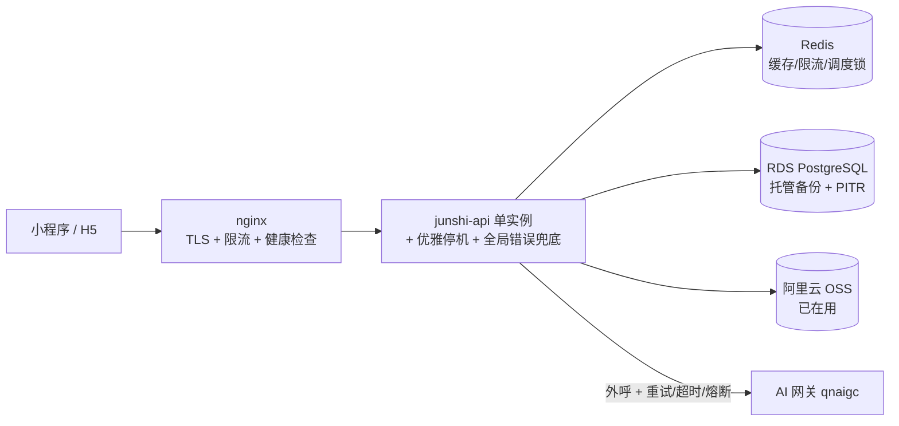
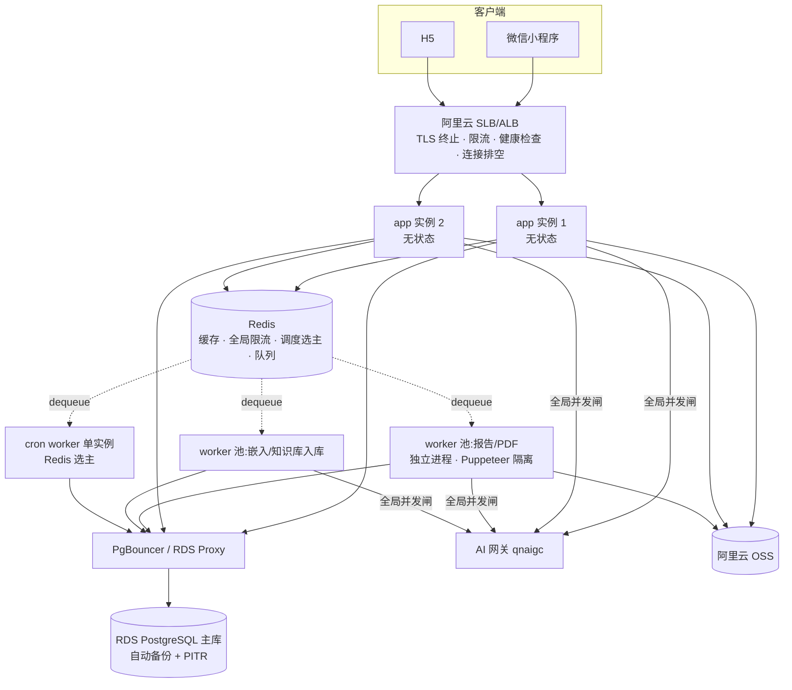
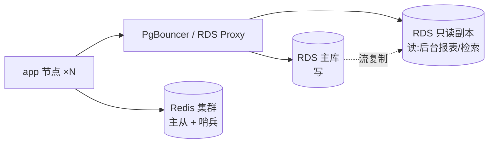

# 军师 · 用户量增长后的分布式部署架构方案(2026-07-22)

> 基于两轮生产审计的真实资源与用量数据设计。核心立场:**当前不需要分布式,需要的是「去单点 + 拆横向扩展障碍」;真正的分布式分阶段、由真实信号触发。**

---

## 0. 先看清:这套系统的瓶颈到底在哪

一切架构决策的地基是资源实况,不是通用最佳实践。生产实测(4 核 / 7.3G / 148G,多租户共用机):

| 维度 | 实测 | 判读 |
|---|---|---|
| CPU | load 0.02,基本闲置 | **不是 CPU 瓶颈** |
| PG 数据量 | junshi 库 31MB,542 切片 / 421 记忆 | **不是数据库瓶颈**(离分库分表十万八千里) |
| 内存 | junshi 峰值 733M;同机 Dify ~1.7G + mino + preprod 636M + 双 Chrome ~380M;available 仅 3.2G;**swap=0** | **首个瓶颈:内存**(Puppeteer 峰值 + 共租户挤占,无交换缓冲 → OOM 无兜底) |
| AI 网关 | qnaigc Opus,单次 chat 均 3.16 万 token、峰值 6.2 万,input:output=33:1 | **真正的吞吐与成本瓶颈,且在机器外部** |
| 用量形态 | 脉冲型:单人单日峰值 190 万 token,最长连续 3 天 | **按 CPU 自动扩容无效**,要按「在途 LLM 请求数 / 队列深度」扩 |

**推论:这是一个「IO 密集 + 外部 AI 依赖 + 内存尖峰」型系统,不是「CPU/DB 密集」型。** 因此:
- 应用层几乎不需要为「算力」扩容——一个 2 核节点能轻松扛几十上百条并发 SSE(它们都在等网关返回,IO-bound)。
- 应用层需要扩容,是为了两件**非算力**的事:① **可用性**(2 节点,部署/崩溃不再全员掉线)② **隔离 Puppeteer 内存尖峰**。
- 花力气的重点应放在:**去单点(备份/HA)** + **AI 网关的全局并发与成本控制** + **长任务异步化**。

---

## 1. 横向扩到「第 2 个实例」会先坏什么(必须先修的障碍)

应用本身是**无状态的**(JWT 走 header、无服务端 session、微信 token 用 stable_token 端点多实例安全)——这是好消息,是能扩的前提。但以下内存态假设了单进程,上第 2 个实例即坏(全部来自审计实证):

| 障碍 | 现状 | 上第 2 实例的后果 | 修法 |
|---|---|---|---|
| 进程内定时器 | `scheduler.ts` 用 `setInterval`,每实例跑全量 job | **重复推送微信订阅消息 + 一次性额度双发** | Redis 选主(leader lock)或抽成独立单实例 cron worker;推送用 `(userId,scene,date)` 唯一约束幂等 |
| 进程内缓存 | `cache.ts` 默认内存 Map(已留 `REDIS_URL` 开关) | 各实例缓存不一致(4s 窗口,危害有界) | 配 Redis,代码缝已就绪 |
| 进程内 Puppeteer | 单浏览器单并发队列,与 PG 争内存 | 无 swap 下并发出报告即 OOM 风险 | 移出到独立 worker 进程池 |
| 无优雅停机 | 无 SIGTERM 处理,部署硬杀 | 每次滚动更新掐断在途 SSE + 漏结算预留 | 加 SIGTERM → 停接新请求 → 排空在途 → `app.close()` |
| PG 连接池 | Prisma 未设 `connection_limit`,默认 核数×2+1 | N 实例 × 默认池 → 打爆 PG `max_connections=100` | 显式设每实例上限 + 前置 PgBouncer/RDS Proxy |
| 无全局限流 | nginx 无 `limit_req`,应用无 rate-limit | 防刷/成本闸在多实例下更失控 | Redis 令牌桶(全局)+ SLB 层限流 |

**一句话:这 6 条修完,应用层就「可横向扩」了——在真正需要之前就该修,因为它们同时也是当前单机的可靠性/成本缺陷。**

---

## 2. 目标架构(四阶段,按信号推进)

### Phase 0 · 去风险 + 备扩容(仍单应用实例,先做隔离与解耦)

**这一步不涉及分布式,但是所有后续的前提,优先级最高。**

要点:
- **PG 迁到独立实例(阿里云 RDS)**——一举解决审计头号风险 P0-4(零备份):托管自动备份 + PITR + 快照。当前 31MB,最小规格即可,几乎零成本。
- **preprod 迁出生产机**,把 Dify 等重租户与 junshi 分箱,**立刻加 swap** 作过渡缓冲。
- **应用侧修完第 1 节的 6 个障碍**——即便还不扩,这些也是当下的可靠性坑。
- 引入 **Redis**(阿里云 Redis 最小规格):即刻用于缓存 + 全局限流 + 调度选主。
- **AI 网关调用补 timeout/重试/退避/熔断**(当前全无),全 provider 生效(含 claude 路径的 timeout,防「切端点即挂 10 分钟」)。

### Phase 1 · 应用层横向扩(2–3 无状态节点 + 队列 + worker)

**触发信号见第 4 节。核心动作:应用无状态多副本 + 长任务异步化。**

要点:
- **SLB 取代 nginx 做入口**:TLS 终止(顺带解决证书 41 天到期无自动续期)、健康检查(挂 DB ping,不是浅 `ok:true`)、连接排空(配合优雅停机做零停机滚动发布)。
- **2 节点起步**:不是为算力,是为可用性(单节点部署/崩溃不再全员掉线)。SSE 无需粘性会话——连接绑定在打开它的实例上,实例挂了客户端重连到另一实例即可。
- **队列(BullMQ / Redis 驱动)是本阶段最高杠杆的结构改造**,承接三类长任务:
  - **报告/PDF 生成** → 独立 worker 池,Puppeteer 彻底移出 API 进程(隔离内存尖峰 + 解决「请求内同步长任务、崩了就丢」)。
  - **知识库确认入库/嵌入** → 异步 worker(解决 P0-7:大批量确认在单请求内串行远程嵌入超时 + 中途失败不回滚)。
  - **辅助抽取**(insight/prophecy,当前 `void` fire-and-forget)→ 入队,带重试与计量。
- **cron worker 单实例化** + Redis 选主(修 P1-4 重复推送)。

### Phase 2 · 数据层与读扩展(负载真涨起来才做)

要点:
- **PG 只读副本**:后台运营报表、知识检索等读密集走副本,主库专注写。**注意:当前 31MB,这一步很可能一两年内都用不上**——列出只为完整。
- **PgBouncer / RDS Proxy 前置**:多实例连接倍增前必须,否则打爆 `max_connections`。
- **Redis 升主从 + 哨兵**:此时 Redis 已是缓存/队列/限流/选主的关键路径,不能再单点。
- **`db push` → `prisma migrate`**:多节点 + 有真实数据后,无迁移史无回滚的裸 `db push` 风险不可接受。

### Phase 3 · 高可用与弹性(规模化后)

- **多可用区**:app 节点、RDS、Redis 跨 AZ,单机房故障不全灭。
- **按脉冲弹性伸缩**:伸缩指标用「在途 LLM 请求数 / 队列深度 / 内存水位」,**不用 CPU**(脉冲型负载 CPU 反应滞后且失真)。
- worker 池独立伸缩(报告高峰扩 report worker,与 API 解耦)。

---

## 3. 关键组件的分布式约束(逐个说清)

| 组件 | 分布式后的关键约束 | 方案 |
|---|---|---|
| **AI 网关(真瓶颈)** | 网关有并发/速率上限;脉冲峰值会瞬间打满;成本需封顶 | **Redis 全局令牌桶**做跨实例并发闸 + 单用户/全局日成本熔断;超限排队而非拒绝。这是分布式后最该建的护栏,比扩节点重要 |
| **应用节点** | 必须真无状态 | 已满足(JWT/无 session);唯一要清的是进程内缓存与定时器(见第 1 节) |
| **SSE 流式** | 连接与实例绑定 | 无需粘性;实例故障靠客户端重连;配合优雅停机排空。补 `X-Accel-Buffering: no`(当前全缺,SLB/nginx 缓冲会憋断流) |
| **Puppeteer** | 内存尖峰 + 与 PG 争内存 | 移入独立 worker 进程池,与 API/DB 物理隔离;单 worker 限并发 + 进程级内存上限 + 定期重启回收 |
| **PostgreSQL** | 连接倍增、备份、迁移 | RDS(备份/PITR)+ PgBouncer + migrate;读副本按需 |
| **Redis** | 从可选变关键路径 | Phase 1 单点可接受,Phase 2 必须主从+哨兵;缓存/队列/限流/选主分逻辑库 |
| **定时任务** | 多实例重复执行 | 选主 or 独立 cron worker + 幂等唯一约束 |
| **对象存储** | 已用 OSS | 保持;报告/PDF/上传统一走 OSS,天然多实例共享,无需动 |
| **可观测性** | 分布式后不能盲跑 | 上 `/metrics`(Prometheus)+ 阿里云 ARMS/云监控;结构化 error 日志 + 请求 ID 贯穿;告警(错误率/AI 成本/队列积压/内存/证书/paid-unapplied) |

---

## 4. 扩容触发信号(什么时候进下一阶段,不靠拍脑袋)

| 动作 | 触发信号 |
|---|---|
| **立即做 Phase 0** | 现在——去单点(备份)与修障碍与负载无关,是开卖前置 |
| 应用扩到 2 节点(Phase 1 起步) | **有付费用户的那一刻**(可用性要求)/ 或内存水位 p95 > 70% / 或并发 SSE > ~100 |
| 加报告 worker 池 | 报告生成 p95 延迟上升 / Puppeteer 触发 OOM / 报告量 > 数百/日 |
| 加嵌入 worker | 知识库确认出现超时 / 单批文档 > 数十份 |
| 加 PG 只读副本 | PG CPU 持续 > 50% 或读 p95 劣化(当前 31MB,极远) |
| 开弹性伸缩 | 脉冲峰值造成 SLB 排队 / 队列深度持续积压 |
| Redis 主从+哨兵 | Redis 进入队列/限流关键路径后(即 Phase 1 稳定运行后)|

---

## 5. 容量粗估(基于真实每用户消耗)

- 单条 SSE + 一次网关调用 ≈ 一个挂起的 fetch + 少量内存,Node 单节点可挂**数百**条并发而不吃 CPU。
- 峰值日(07-18)全天 384 万 token / 7 活跃用户;单用户单日峰值 190 万。**并发瓶颈不是节点数,是网关能同时处理多少条 in-flight 请求**。
- **粗算:2 核 / 4G 的单应用节点,配全局并发闸(比如同时 20–40 条网关请求),足以支撑数百 DAU 的脉冲。** 真正先顶不住的会是:① AI 网关的并发配额 ② 报告并发时的 Puppeteer 内存。二者都靠「worker 池 + 全局闸」解决,而非无脑加 app 节点。
- **别过早分库分表**:PG 到达单机瓶颈(比如几百 GB / 写 QPS 上千)在当前数据增速下是数年尺度的事。

---

## 6. 落地顺序(与售卖前 backlog 对齐)

1. **Phase 0 全部**——PG 迁 RDS(拿到备份)、preprod 迁出 + 加 swap、修 6 个横向扩障碍、Redis 接入、网关补超时/重试/熔断、可观测最小集。**这些多数已在售卖前 P0/P1 清单里,做完即「可随时扩」。**
2. **有付费用户 → Phase 1 起步**:SLB + 2 无状态节点 + 队列 + 报告/嵌入 worker + cron 选主。
3. **负载信号触发 → Phase 2**:PgBouncer、只读副本、Redis 主从、migrate 化。
4. **规模化 → Phase 3**:多 AZ + 按队列深度/内存弹性伸缩。

---

## 附:一句话总纲

> **先把「一台机器什么都干、还和 Dify 挤内存、没备份」拆成「托管 PG + Redis + 无状态 app + 独立 worker」,再谈多副本。** 分布式的意义在这套系统里首先是**可靠性与内存隔离**,其次才是吞吐;而真正的吞吐天花板在**外部 AI 网关**——用全局并发闸和队列去管它,比堆节点有效得多。
